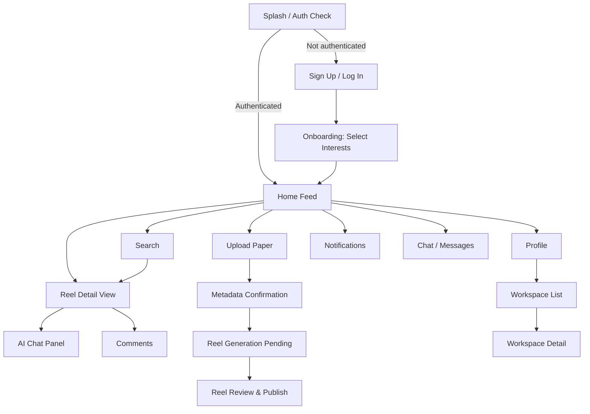
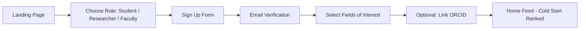
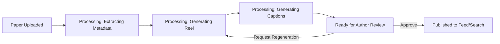

# ResearchReel
## Volume 1 — Software Requirements Specification (SRS)

**Document Version:** 1.0
**Status:** Draft for Review
**Classification:** Internal / Confidential
**Related Documents:** Volume 2 (Software Architecture), Volume 3 (Database & API), Volume 4 (Security & DevOps), Volume 5 (UI/UX & Wireframes)

---

## Table of Contents

1. [Introduction](#1-introduction)
2. [Vision](#2-vision)
3. [Objectives](#3-objectives)
4. [Stakeholders & User Personas](#4-stakeholders--user-personas)
5. [Scope](#5-scope)
6. [Functional Requirements](#6-functional-requirements)
7. [Non-Functional Requirements](#7-non-functional-requirements)
8. [User Stories](#8-user-stories)
9. [Use Cases](#9-use-cases)
10. [Requirement Traceability Matrix](#10-requirement-traceability-matrix)
11. [UI Flow](#11-ui-flow)
12. [Feature Specifications](#12-feature-specifications)
13. [Appendices](#13-appendices)

---

## 1. Introduction

### 1.1 Purpose

This document specifies the functional and non-functional requirements for **ResearchReel**, a decentralized, research-centric social platform that converts academic papers into short-form video "reels," layers AI-powered question-answering on top of them, and connects students, researchers, and faculty in a single network. It is intended to be the authoritative reference for product, engineering, QA, and design teams during planning, implementation, and acceptance testing.

### 1.2 Scope of This Document

This SRS covers the full ResearchReel product surface as of the current planning horizon, including the core web/mobile application, the AI/RAG subsystem, the browser extension, and the third-party plugin platform. It does not specify implementation details (covered in Volume 2), schema design (Volume 3), security controls (Volume 4), or pixel-level UI design (Volume 5) — though it cross-references all four where requirements depend on them.

### 1.3 Document Conventions

- Functional requirements are identified as **FR-###** and grouped by module.
- Non-functional requirements are identified as **NFR-###**.
- Priority levels follow MoSCoW: **Must**, **Should**, **Could**, **Won't (this release)**.
- "System" refers to ResearchReel as a whole unless a specific microservice is named.
- Requirement text uses "shall" for mandatory behavior and "should" for recommended behavior, per IEEE 830 convention.

### 1.4 Intended Audience

Product managers, software architects, backend/frontend/mobile engineers, QA engineers, security reviewers, UX designers, and prospective technical due-diligence reviewers (e.g., investors' technical advisors).

### 1.5 References

- ResearchReel Software Architecture Document (internal)
- IEEE 830-1998 — Recommended Practice for Software Requirements Specifications
- WCAG 2.1 — Web Content Accessibility Guidelines
- OWASP ASVS 4.0 — Application Security Verification Standard
- GDPR (EU) 2016/679, CCPA (California Civil Code §1798.100 et seq.)

---

## 2. Vision

> **ResearchReel makes the world's research watchable, askable, and discoverable — turning every paper into a 60-second conversation instead of a 20-page wall of text.**

Academic knowledge is growing faster than anyone's ability to read it. ResearchReel's vision is to become the primary discovery and comprehension layer for academic research — sitting between the paper and the reader — by combining three previously disconnected experiences:

1. **Short-form video**, the format an entire generation already uses to learn and discover.
2. **Conversational AI**, so a reader can interrogate a paper instead of merely skimming it.
3. **A social/academic graph**, so discovery, mentorship, and credibility compound over time instead of resetting with every new paper.

In five years, ResearchReel aims to be the default way early-career researchers and students first encounter new work in their field — and a credible secondary distribution channel that authors and institutions actively want their papers to appear on.

---

## 3. Objectives

### 3.1 Business Objectives

| ID | Objective | Target Horizon |
|---|---|---|
| BO-1 | Reach 1,000,000+ registered users | 36 months |
| BO-2 | Support 100,000 peak concurrent users without degraded latency | 24 months |
| BO-3 | Establish a sustainable advertising/sponsored-content revenue stream | 12 months |
| BO-4 | Sign institutional pilot partnerships with 10+ universities | 18 months |
| BO-5 | Achieve positive unit economics on ad-supported active users | 24 months |

### 3.2 Product Objectives

| ID | Objective |
|---|---|
| PO-1 | Reduce the time to understand a paper's core contribution from ~20 minutes (full read) to under 2 minutes (reel + AI Q&A) |
| PO-2 | Provide a citation-aware discovery experience that surfaces supporting and contradicting work, not just keyword matches |
| PO-3 | Give every researcher a "second channel" to be discovered beyond their home journal |
| PO-4 | Make the platform extensible via a first-party browser extension and third-party plugin SDK |
| PO-5 | Maintain sub-100ms p95 feed and search latency at target scale |

### 3.3 Success Metrics (KPIs)

| Metric | Definition | Target |
|---|---|---|
| Activation Rate | % of new signups who watch ≥3 reels or ask ≥1 AI question in first session | ≥ 60% |
| D7 Retention | % of new users active 7 days after signup | ≥ 25% |
| Reel Completion Rate | % of reels watched to ≥80% of duration | ≥ 50% |
| AI Chat Engagement | Avg. AI questions asked per active researcher/student per week | ≥ 3 |
| Paper Upload Throughput | Time from upload to reel availability (p95) | < 60 sec |
| Search Latency | p95 search response time | < 100 ms |
| Feed Latency | p95 feed generation time | < 100 ms |

---

## 4. Stakeholders & User Personas

| Stakeholder | Interest |
|---|---|
| Students | Fast, digestible access to relevant research; AI tutoring on papers |
| Researchers / PhD candidates | Visibility for their work; discovery of adjacent research; community |
| Professors / Faculty | Mentorship tools, curation, classroom-adjacent use, staying current |
| Institutions / Universities | Branding, recruitment, pilot partnerships, citation visibility |
| Advertisers / Sponsors | Access to a high-intent academic/EdTech audience |
| Platform Admins / Moderators | Content integrity, abuse prevention, policy enforcement |
| Plugin Developers | API/SDK access to build on top of the ResearchReel graph |

### Primary Personas

- **"Maya," the Undergraduate Student** — wants to keep up with coursework-adjacent research without reading full papers; primarily mobile.
- **"Dr. Amir," the Early-Career Researcher** — wants visibility for his publications and to track citing/cited work; uses AI chat to vet related work quickly.
- **"Prof. Lindqvist," the Faculty Mentor** — curates reading lists for students, follows specific sub-fields, occasionally publishes.
- **"Casey," the Platform Moderator** — reviews flagged content, manages takedown requests, enforces academic-integrity policy.
- **"Jordan," the Plugin Developer** — builds a third-party citation-manager integration using the ResearchReel SDK.

---

## 5. Scope

### 5.1 In Scope (Current Release Horizon)

- Web application (responsive) and native mobile clients (iOS/Android parity)
- Paper ingestion (PDF upload + DOI linking), reel generation pipeline, AI/RAG chat
- Search, recommendation feed, citation graph, social graph, workspace, chat, notifications, leaderboard, analytics
- Browser extension for one-click paper capture and reel preview
- Plugin/integration SDK (v1, read-mostly API surface)
- Advertising and sponsored-content placement
- Admin/moderation tooling

### 5.2 Out of Scope (This Release)

- Native desktop application (tracked for a future release; IPC architecture is specified in Volume 2 to avoid rework)
- Peer-review workflow / journal submission tooling
- Paid subscription tiers (explicitly deferred pending monetization validation — see Volume 1 §3.1, BO-3)
- Real-time co-authoring / collaborative document editing beyond Workspace annotations
- Non-English-first UI localization (tracked as a fast-follow; see NFR-Localization)

---

## 6. Functional Requirements

Requirements are grouped by module. Each requirement includes an ID, description, and MoSCoW priority. IDs are stable across volumes for traceability.

### 6.1 Authentication & Identity (FR-AUTH)

| ID | Requirement | Priority |
|---|---|---|
| FR-AUTH-001 | The system shall allow registration via email + password. | Must |
| FR-AUTH-002 | The system shall allow registration via OAuth (Google, ORCID, Microsoft institutional accounts). | Must |
| FR-AUTH-003 | The system shall verify email ownership via a time-limited OTP before granting full account access. | Must |
| FR-AUTH-004 | The system shall support password reset via verified email. | Must |
| FR-AUTH-005 | The system shall issue short-lived JWT access tokens and longer-lived refresh tokens. | Must |
| FR-AUTH-006 | The system shall support session revocation ("log out of all devices"). | Should |
| FR-AUTH-007 | The system shall support role-based accounts: Student, Researcher, Faculty, Institution Admin, Platform Admin, Moderator. | Must |
| FR-AUTH-008 | The system shall allow users to link an ORCID iD to their profile for identity verification. | Should |
| FR-AUTH-009 | The system shall support multi-factor authentication (TOTP) as an opt-in security feature. | Should |
| FR-AUTH-010 | The system shall lock an account after 10 consecutive failed login attempts and notify the user. | Must |

### 6.2 User Profile (FR-PROF)

| ID | Requirement | Priority |
|---|---|---|
| FR-PROF-001 | The system shall allow users to create a profile with name, affiliation, bio, and field(s) of interest. | Must |
| FR-PROF-002 | The system shall allow researchers to list academic credentials (degrees, institution, advisor). | Must |
| FR-PROF-003 | The system shall allow users to upload a profile photo. | Must |
| FR-PROF-004 | The system shall display a verified badge for users with a confirmed institutional email or ORCID link. | Should |
| FR-PROF-005 | The system shall allow users to set profile visibility (public, followers-only, private). | Should |
| FR-PROF-006 | The system shall display aggregate stats on a profile (papers uploaded, reels watched contributed, followers). | Could |
| FR-PROF-007 | The system shall allow users to export their profile and content data (data portability). | Must |
| FR-PROF-008 | The system shall allow account deactivation and full deletion per data-retention policy. | Must |

### 6.3 Research Paper Management (FR-PAPER)

| ID | Requirement | Priority |
|---|---|---|
| FR-PAPER-001 | The system shall allow upload of PDF papers up to 100MB. | Must |
| FR-PAPER-002 | The system shall allow linking a paper via DOI instead of direct upload. | Must |
| FR-PAPER-003 | The system shall extract metadata (title, authors, abstract, publication date, venue) automatically on upload. | Must |
| FR-PAPER-004 | The system shall validate DOIs against a public DOI resolver before accepting a linked paper. | Must |
| FR-PAPER-005 | The system shall support versioned revisions of an uploaded paper (e.g., preprint → camera-ready). | Should |
| FR-PAPER-006 | The system shall allow co-author tagging with confirmation from tagged users. | Should |
| FR-PAPER-007 | The system shall reject duplicate uploads of an already-indexed DOI and link to the existing entry. | Must |
| FR-PAPER-008 | The system shall allow authors to request takedown of their own uploaded paper. | Must |
| FR-PAPER-009 | The system shall store the original PDF immutably alongside any derived assets. | Must |
| FR-PAPER-010 | The system shall display extracted full-text alongside the generated reel for accessibility. | Should |
| FR-PAPER-011 | The system shall flag papers suspected of plagiarism or retraction via integration with a retraction database. | Could |
| FR-PAPER-012 | The system shall allow tagging a paper with a license type (e.g., CC-BY, all-rights-reserved). | Must |

### 6.4 Reel Service (FR-REEL)

| ID | Requirement | Priority |
|---|---|---|
| FR-REEL-001 | The system shall automatically generate a 30–60 second video reel from an uploaded paper. | Must |
| FR-REEL-002 | The system shall auto-generate captions/subtitles for every reel. | Must |
| FR-REEL-003 | The system shall allow the uploading author to review and approve the generated reel before it is published. | Should |
| FR-REEL-004 | The system shall allow the author to regenerate a reel with adjusted emphasis (e.g., "focus on methodology"). | Could |
| FR-REEL-005 | The system shall support likes, comments, and shares on a reel. | Must |
| FR-REEL-006 | The system shall track view counts, watch-through rate, and average watch duration per reel. | Must |
| FR-REEL-007 | The system shall allow users to bookmark/save a reel to a personal collection. | Should |
| FR-REEL-008 | The system shall display a "read full paper" call-to-action linking to the source PDF/DOI. | Must |
| FR-REEL-009 | The system shall support reporting a reel for policy violations. | Must |
| FR-REEL-010 | The system shall allow comments to be threaded and sorted by recency or relevance. | Should |
| FR-REEL-011 | The system shall transcode reels into adaptive-bitrate HLS for varying network conditions. | Must |
| FR-REEL-012 | The system shall generate a thumbnail and short text summary for each reel for use in feed/search previews. | Must |

### 6.5 Video Processing (FR-VID)

| ID | Requirement | Priority |
|---|---|---|
| FR-VID-001 | The system shall transcode uploaded/generated video into multiple bitrate renditions. | Must |
| FR-VID-002 | The system shall generate auto-captions via speech-to-text on any narrated audio track. | Must |
| FR-VID-003 | The system shall generate a representative thumbnail frame automatically. | Must |
| FR-VID-004 | The system shall queue transcoding jobs and report queue position/status to the uploading client. | Should |
| FR-VID-005 | The system shall retry failed transcoding jobs up to 3 times before flagging for manual review. | Must |
| FR-VID-006 | The system shall scan uploaded media for known abusive-content hashes prior to publishing. | Must |
| FR-VID-007 | The system shall support watermarking reels with the ResearchReel brand mark for shared/embedded use. | Could |
| FR-VID-008 | The system shall enforce a maximum reel duration of 90 seconds at generation time. | Must |

### 6.6 AI / RAG Service (FR-AI)

| ID | Requirement | Priority |
|---|---|---|
| FR-AI-001 | The system shall chunk and embed paper text for retrieval-augmented generation. | Must |
| FR-AI-002 | The system shall allow a user to ask a free-text question about a specific paper and receive a grounded answer. | Must |
| FR-AI-003 | The system shall cite the specific section/page of the source paper supporting each AI answer. | Must |
| FR-AI-004 | The system shall decline to answer questions unrelated to the paper's content and indicate scope. | Must |
| FR-AI-005 | The system shall maintain a per-session conversation history for follow-up questions. | Should |
| FR-AI-006 | The system shall generate an auto-summary (abstract-level and ELI5-level) for every ingested paper. | Must |
| FR-AI-007 | The system shall flag and surface methodology/limitations sections when asked about study validity. | Should |
| FR-AI-008 | The system shall rate-limit AI chat requests per user to control inference cost. | Must |
| FR-AI-009 | The system shall allow users to flag an AI answer as inaccurate, feeding a review queue. | Should |
| FR-AI-010 | The system shall support multi-paper comparison queries (e.g., "how does this differ from paper X"). | Could |
| FR-AI-011 | The system shall regenerate embeddings automatically when a paper is revised to a new version. | Should |
| FR-AI-012 | The system shall display a confidence indicator or "low confidence" warning on uncertain AI answers. | Could |

### 6.7 Citation Intelligence (FR-CITE)

| ID | Requirement | Priority |
|---|---|---|
| FR-CITE-001 | The system shall build a citation graph linking papers to the works they cite. | Must |
| FR-CITE-002 | The system shall classify citations as supporting, contradicting, or neutral relative to the citing claim. | Should |
| FR-CITE-003 | The system shall display "cited by" and "cites" lists on a paper's detail view. | Must |
| FR-CITE-004 | The system shall surface a citation-network visualization for a given paper or author. | Could |
| FR-CITE-005 | The system shall alert an author when their paper is newly cited by another work on the platform. | Should |
| FR-CITE-006 | The system shall compute and display a basic citation-count metric per paper and per author. | Must |
| FR-CITE-007 | The system shall detect and flag potential citation rings or anomalous self-citation patterns for moderation review. | Could |
| FR-CITE-008 | The system shall allow filtering search/feed results by citation count or recency. | Should |

### 6.8 Recommendation (FR-REC)

| ID | Requirement | Priority |
|---|---|---|
| FR-REC-001 | The system shall rank the home feed using a combination of interest match, recency, and engagement signals. | Must |
| FR-REC-002 | The system shall allow users to explicitly follow topics, authors, or institutions to influence their feed. | Must |
| FR-REC-003 | The system shall down-rank or exclude content from authors/topics a user has muted or blocked. | Must |
| FR-REC-004 | The system shall surface a "trending in your field" feed module. | Should |
| FR-REC-005 | The system shall avoid showing the same reel twice in a session unless re-engaged with intentionally. | Should |
| FR-REC-006 | The system shall cold-start new users' feeds using onboarding-selected interests. | Must |
| FR-REC-007 | The system shall log feed impressions and interactions for ranking-model retraining. | Must |
| FR-REC-008 | The system shall support sponsored/promoted reels inserted into the feed at a configurable frequency, clearly labeled. | Must |

### 6.9 Search (FR-SEARCH)

| ID | Requirement | Priority |
|---|---|---|
| FR-SEARCH-001 | The system shall support full-text keyword search across paper titles, abstracts, and authors. | Must |
| FR-SEARCH-002 | The system shall support search-as-you-type with autocomplete suggestions. | Should |
| FR-SEARCH-003 | The system shall support filtering search results by field, date range, institution, and citation count. | Must |
| FR-SEARCH-004 | The system shall support searching by author name with disambiguation between same-named authors. | Should |
| FR-SEARCH-005 | The system shall support searching for institutions and listing their affiliated researchers/papers. | Could |
| FR-SEARCH-006 | The system shall return zero-result search states with suggested alternative queries. | Should |
| FR-SEARCH-007 | The system shall support semantic (vector-based) search in addition to keyword search. | Could |
| FR-SEARCH-008 | The system shall log search queries (anonymized) to improve ranking quality over time. | Should |

### 6.10 Workspace (FR-WORK)

| ID | Requirement | Priority |
|---|---|---|
| FR-WORK-001 | The system shall allow users to create a collaborative workspace for a research project. | Must |
| FR-WORK-002 | The system shall support LaTeX rendering within workspace documents. | Should |
| FR-WORK-003 | The system shall allow inviting collaborators to a workspace with role-based permissions (owner, editor, viewer). | Must |
| FR-WORK-004 | The system shall support annotation/commenting directly on an attached paper within a workspace. | Should |
| FR-WORK-005 | The system shall support a kanban-style project board within a workspace. | Could |
| FR-WORK-006 | The system shall version workspace documents and allow reverting to a prior version. | Should |
| FR-WORK-007 | The system shall notify workspace members of relevant activity (new comment, new document). | Must |
| FR-WORK-008 | The system shall allow exporting a workspace's documents as a zip archive. | Could |
| FR-WORK-009 | The system shall support linking a workspace to one or more papers from the platform's corpus. | Should |
| FR-WORK-010 | The system shall enforce workspace storage quotas per account tier. | Should |

### 6.11 Chat (FR-CHAT)

| ID | Requirement | Priority |
|---|---|---|
| FR-CHAT-001 | The system shall support 1:1 direct messaging between users. | Must |
| FR-CHAT-002 | The system shall support group chat rooms. | Should |
| FR-CHAT-003 | The system shall deliver messages in real time via WebSocket with a fallback to polling. | Must |
| FR-CHAT-004 | The system shall persist chat history and support scrollback/search within a conversation. | Must |
| FR-CHAT-005 | The system shall support sharing a paper or reel directly into a chat conversation as a rich preview. | Should |
| FR-CHAT-006 | The system shall display online/last-seen presence indicators (user-configurable visibility). | Could |
| FR-CHAT-007 | The system shall allow blocking a user from initiating new direct messages. | Must |
| FR-CHAT-008 | The system shall support reporting abusive messages to moderation. | Must |

### 6.12 Social Graph (FR-SOC)

| ID | Requirement | Priority |
|---|---|---|
| FR-SOC-001 | The system shall support following/unfollowing other users. | Must |
| FR-SOC-002 | The system shall model co-author relationships automatically from paper metadata. | Should |
| FR-SOC-003 | The system shall support an explicit "mentor/mentee" relationship type between users. | Could |
| FR-SOC-004 | The system shall recommend new connections based on shared field, institution, or co-citation. | Should |
| FR-SOC-005 | The system shall display mutual connections between two profiles. | Could |
| FR-SOC-006 | The system shall allow blocking another user, which removes mutual visibility across the platform. | Must |
| FR-SOC-007 | The system shall support institution-level pages aggregating affiliated researchers and papers. | Should |
| FR-SOC-008 | The system shall display a follower/following count and list on user profiles, respecting privacy settings. | Must |

### 6.13 Notifications (FR-NOTIF)

| ID | Requirement | Priority |
|---|---|---|
| FR-NOTIF-001 | The system shall send push notifications for new followers, comments, and citations. | Must |
| FR-NOTIF-002 | The system shall send a configurable digest email (daily/weekly/off). | Must |
| FR-NOTIF-003 | The system shall allow per-category notification preferences (social, citations, system). | Must |
| FR-NOTIF-004 | The system shall deliver in-app notification badges with unread counts. | Must |
| FR-NOTIF-005 | The system shall support SMS alerts for critical account-security events only. | Could |
| FR-NOTIF-006 | The system shall retry failed notification delivery with exponential backoff. | Should |
| FR-NOTIF-007 | The system shall provide a notification center listing the last 30 days of activity. | Should |
| FR-NOTIF-008 | The system shall suppress duplicate notifications for the same event within a short debounce window. | Should |

### 6.14 Leaderboard (FR-LEAD)

| ID | Requirement | Priority |
|---|---|---|
| FR-LEAD-001 | The system shall display a trending-papers leaderboard updated in near-real-time. | Should |
| FR-LEAD-002 | The system shall display a top-institutions leaderboard by aggregate engagement. | Could |
| FR-LEAD-003 | The system shall display a top-reviewers/top-contributors leaderboard based on platform contribution score. | Could |
| FR-LEAD-004 | The system shall allow filtering leaderboards by field, time window, and region. | Should |
| FR-LEAD-005 | The system shall exclude sponsored/promoted content from organic leaderboard rankings. | Must |
| FR-LEAD-006 | The system shall recompute leaderboard scores on a scheduled interval, not purely on-demand. | Should |

### 6.15 Analytics (FR-ANLY)

| ID | Requirement | Priority |
|---|---|---|
| FR-ANLY-001 | The system shall capture clickstream events (views, clicks, watch time) for all major surfaces. | Must |
| FR-ANLY-002 | The system shall provide authors with a dashboard of their paper/reel performance metrics. | Should |
| FR-ANLY-003 | The system shall provide platform-level admin dashboards for DAU/MAU, retention, and engagement. | Must |
| FR-ANLY-004 | The system shall anonymize or pseudonymize analytics data in accordance with privacy policy. | Must |
| FR-ANLY-005 | The system shall support exporting aggregate analytics as CSV for institutional partners. | Could |
| FR-ANLY-006 | The system shall track funnel conversion from signup through activation milestones. | Should |
| FR-ANLY-007 | The system shall support A/B experiment instrumentation for feed-ranking and onboarding changes. | Should |
| FR-ANLY-008 | The system shall retain raw event data per the data-retention policy and roll up older data into aggregates. | Must |

### 6.16 Browser Extension (FR-EXT)

| ID | Requirement | Priority |
|---|---|---|
| FR-EXT-001 | The extension shall allow one-click capture of a paper from a publisher page (PDF URL or DOI detection). | Must |
| FR-EXT-002 | The extension shall show a preview of the generated reel without leaving the current page, once available. | Should |
| FR-EXT-003 | The extension shall authenticate using the same account session as the web application (SSO). | Must |
| FR-EXT-004 | The extension shall detect DOIs present on the current page and offer to import them in bulk. | Could |
| FR-EXT-005 | The extension shall allow saving a page/paper to a workspace directly from the browser toolbar. | Should |
| FR-EXT-006 | The extension shall respect publisher robots/paywall restrictions and never bypass access controls. | Must |
| FR-EXT-007 | The extension shall support Chrome and Firefox at initial launch, with Edge as a fast-follow. | Should |
| FR-EXT-008 | The extension shall notify the user in-browser when a captured paper's reel finishes processing. | Could |
| FR-EXT-009 | The extension shall allow quick AI-chat querying of a captured paper directly from the toolbar popup. | Should |
| FR-EXT-010 | The extension shall provide an option to disable capture on specified domains. | Could |

### 6.17 Plugin / Integration Platform (FR-PLUG)

| ID | Requirement | Priority |
|---|---|---|
| FR-PLUG-001 | The system shall expose a versioned public API for third-party plugin developers. | Must |
| FR-PLUG-002 | The system shall require OAuth-based app registration and scoped API keys for plugin access. | Must |
| FR-PLUG-003 | The system shall provide a plugin marketplace/directory within the application. | Should |
| FR-PLUG-004 | The system shall allow users to install and authorize a plugin with explicit scope consent. | Must |
| FR-PLUG-005 | The system shall allow users to revoke a plugin's access at any time. | Must |
| FR-PLUG-006 | The system shall sandbox plugin UI surfaces to prevent unauthorized access to host-page data. | Must |
| FR-PLUG-007 | The system shall rate-limit plugin API usage per registered application. | Must |
| FR-PLUG-008 | The system shall provide webhooks for key events (new citation, new follower) to subscribed plugins. | Should |
| FR-PLUG-009 | The system shall provide a sandboxed developer/testing environment separate from production data. | Should |
| FR-PLUG-010 | The system shall review and approve plugins before marketplace listing per a documented policy. | Must |

### 6.18 Administration & Moderation (FR-ADMIN)

| ID | Requirement | Priority |
|---|---|---|
| FR-ADMIN-001 | The system shall provide a moderation queue for reported content (reels, comments, messages). | Must |
| FR-ADMIN-002 | The system shall allow moderators to remove content and issue warnings/suspensions to accounts. | Must |
| FR-ADMIN-003 | The system shall log all moderation actions with actor, timestamp, and reason for audit purposes. | Must |
| FR-ADMIN-004 | The system shall provide an appeals workflow for users contesting a moderation decision. | Should |
| FR-ADMIN-005 | The system shall allow platform admins to manage feature flags per cohort/region. | Should |
| FR-ADMIN-006 | The system shall allow institution admins to manage their institution's verified-affiliate roster. | Could |
| FR-ADMIN-007 | The system shall provide a takedown workflow for copyright/DMCA-style requests. | Must |
| FR-ADMIN-008 | The system shall support bulk content actions (e.g., mass-removal of a spam campaign). | Should |

**Total Functional Requirements: 162**

---

## 7. Non-Functional Requirements

### 7.1 Performance

| ID | Requirement | Priority |
|---|---|---|
| NFR-PERF-001 | Feed generation shall complete within 100ms at p95 under target load. | Must |
| NFR-PERF-002 | Search queries shall return within 100ms at p95. | Must |
| NFR-PERF-003 | Reel transcoding queue shall drain within 60 seconds per reel at p95 under target load. | Must |
| NFR-PERF-004 | The API Gateway shall sustain ≥5,000 requests/second. | Must |
| NFR-PERF-005 | AI/RAG chat responses shall return a first token within 2 seconds at p95. | Should |

### 7.2 Scalability

| ID | Requirement | Priority |
|---|---|---|
| NFR-SCALE-001 | The system shall support 1,000,000+ registered users. | Must |
| NFR-SCALE-002 | The system shall support 100,000 peak concurrent sessions. | Must |
| NFR-SCALE-003 | All stateless services shall scale horizontally via container orchestration without manual intervention. | Must |
| NFR-SCALE-004 | Stateful datastores shall support read-replica or sharded scaling without downtime. | Should |

### 7.3 Availability & Reliability

| ID | Requirement | Priority |
|---|---|---|
| NFR-AVAIL-001 | Core read paths (feed, search, paper view) shall maintain 99.9% monthly availability. | Must |
| NFR-AVAIL-002 | The system shall degrade gracefully (e.g., serve cached feed) during partial AI-service outages. | Should |
| NFR-AVAIL-003 | Recovery Time Objective (RTO) for a full regional outage shall be ≤ 4 hours. | Must |
| NFR-AVAIL-004 | Recovery Point Objective (RPO) for primary datastores shall be ≤ 15 minutes. | Must |

### 7.4 Security

| ID | Requirement | Priority |
|---|---|---|
| NFR-SEC-001 | All data in transit shall be encrypted via TLS 1.3. | Must |
| NFR-SEC-002 | Passwords shall be hashed with Argon2id. | Must |
| NFR-SEC-003 | The system shall implement role-based access control (RBAC) for all administrative functions. | Must |
| NFR-SEC-004 | The system shall undergo a third-party penetration test prior to each major release. | Should |
| NFR-SEC-005 | Secrets shall never be stored in source control, container images, or plaintext config. | Must |

*(Full security requirements are detailed in Volume 4 — Security & DevOps.)*

### 7.5 Usability & Accessibility

| ID | Requirement | Priority |
|---|---|---|
| NFR-UX-001 | The web and mobile applications shall conform to WCAG 2.1 Level AA. | Must |
| NFR-UX-002 | All reels shall include accurate captions by default for accessibility. | Must |
| NFR-UX-003 | Core flows (signup, upload, search, chat) shall be completable via keyboard navigation alone. | Should |
| NFR-UX-004 | The system shall support a high-contrast / reduced-motion display mode. | Should |

### 7.6 Maintainability

| ID | Requirement | Priority |
|---|---|---|
| NFR-MAINT-001 | Each microservice shall be independently deployable without requiring a coordinated multi-service release. | Must |
| NFR-MAINT-002 | The system shall maintain ≥70% automated test coverage on core backend services. | Should |
| NFR-MAINT-003 | All services shall expose structured logs and a standard health endpoint. | Must |

### 7.7 Compliance & Privacy

| ID | Requirement | Priority |
|---|---|---|
| NFR-COMP-001 | The system shall support data export and deletion requests in line with GDPR Articles 15/17. | Must |
| NFR-COMP-002 | The system shall support CCPA opt-out of data sale/sharing for California residents. | Must |
| NFR-COMP-003 | The system shall not knowingly permit registration of users under the age of 13; accounts for users 13–17 shall apply restricted data-sharing defaults. | Must |
| NFR-COMP-004 | Advertising shall be clearly labeled as such, distinct from organic content, in compliance with applicable ad-disclosure regulations. | Must |

### 7.8 Localization

| ID | Requirement | Priority |
|---|---|---|
| NFR-LOC-001 | The system architecture shall externalize all user-facing strings to support future localization. | Should |
| NFR-LOC-002 | The system shall support right-to-left (RTL) layout rendering as a future-compatible design constraint. | Could |

---

## 8. User Stories

Organized by persona. Format: *As a [persona], I want [capability], so that [benefit].*

### 8.1 Student

| ID | User Story | Related FRs |
|---|---|---|
| US-STU-01 | As a student, I want to watch a short reel of a paper instead of reading it in full, so that I can quickly decide if it's relevant to my coursework. | FR-REEL-001 |
| US-STU-02 | As a student, I want to ask the AI "what method did they use," so that I don't have to hunt through the methodology section myself. | FR-AI-002 |
| US-STU-03 | As a student, I want my feed to reflect the courses/topics I care about, so that I don't waste time scrolling past irrelevant content. | FR-REC-001, FR-REC-006 |
| US-STU-04 | As a student, I want to save reels to a collection, so that I can revisit them before an exam. | FR-REEL-007 |
| US-STU-05 | As a student, I want to follow a professor, so that I see their recommended readings in my feed. | FR-SOC-001 |

### 8.2 Researcher / PhD Candidate

| ID | User Story | Related FRs |
|---|---|---|
| US-RES-01 | As a researcher, I want my uploaded paper to auto-generate a reel, so that more people discover my work without extra effort on my part. | FR-PAPER-001, FR-REEL-001 |
| US-RES-02 | As a researcher, I want to see who has cited my paper, so that I can track the impact of my work. | FR-CITE-005, FR-CITE-006 |
| US-RES-03 | As a researcher, I want to review the AI-generated reel before it's published, so that I can correct any misrepresentation of my findings. | FR-REEL-003 |
| US-RES-04 | As a researcher, I want to link my ORCID iD, so that my identity and publication history are verifiably mine. | FR-AUTH-008 |
| US-RES-05 | As a researcher, I want analytics on my reel's watch-through rate, so that I understand how my work is being engaged with. | FR-ANLY-002 |

### 8.3 Professor / Faculty

| ID | User Story | Related FRs |
|---|---|---|
| US-FAC-01 | As a professor, I want to create a workspace and invite my lab, so that we can annotate papers together. | FR-WORK-001, FR-WORK-003 |
| US-FAC-02 | As a professor, I want to curate a reading list of reels for my students, so that I can guide their independent study. | FR-REEL-007, FR-WORK-009 |
| US-FAC-03 | As a professor, I want to be notified when a student I mentor uploads a paper, so that I can support their publishing journey. | FR-NOTIF-001, FR-SOC-003 |

### 8.4 Institution Admin

| ID | User Story | Related FRs |
|---|---|---|
| US-INST-01 | As an institution admin, I want a verified institution page, so that our affiliated researchers and papers are easy to discover together. | FR-SOC-007 |
| US-INST-02 | As an institution admin, I want aggregate engagement analytics for our institution's content, so that I can report value to leadership. | FR-ANLY-005 |

### 8.5 Moderator / Platform Admin

| ID | User Story | Related FRs |
|---|---|---|
| US-MOD-01 | As a moderator, I want a queue of reported content sorted by severity, so that I can address the most harmful issues first. | FR-ADMIN-001 |
| US-MOD-02 | As a moderator, I want a full audit log of past moderation actions, so that decisions are accountable and reversible if needed. | FR-ADMIN-003 |
| US-MOD-03 | As a platform admin, I want to toggle feature flags by cohort, so that I can roll out risky changes gradually. | FR-ADMIN-005 |

### 8.6 Plugin Developer

| ID | User Story | Related FRs |
|---|---|---|
| US-DEV-01 | As a plugin developer, I want a sandboxed test environment, so that I can build against the API without risking production data. | FR-PLUG-009 |
| US-DEV-02 | As a plugin developer, I want webhooks for citation events, so that my citation-manager integration stays in sync in near-real-time. | FR-PLUG-008 |

---

## 9. Use Cases

Detailed specifications for the platform's most critical workflows. Each follows: Actor, Preconditions, Main Flow, Alternate/Exception Flows, Postconditions, Related Requirements.

### UC-01: Upload a Paper and Generate a Reel

- **Actor:** Researcher
- **Preconditions:** User is authenticated; user has Researcher or Faculty role.
- **Main Flow:**
  1. User navigates to "Upload Paper."
  2. User selects a PDF file or enters a DOI.
  3. System validates file size/type or resolves the DOI.
  4. System extracts metadata (title, authors, abstract) and presents it for confirmation.
  5. User confirms metadata and submits.
  6. System publishes a `paper-uploaded` event to the event bus.
  7. AI/RAG service ingests and embeds the paper; Video Processing service generates the reel.
  8. System notifies the user when the reel is ready for review.
  9. User reviews and approves the reel for publishing.
- **Alternate Flows:**
  - 3a. DOI does not resolve → system shows an error and allows manual metadata entry.
  - 7a. Reel generation fails → system retries up to 3 times, then notifies the user and flags for manual support.
- **Postconditions:** Paper and reel are indexed and discoverable in search and feed.
- **Related Requirements:** FR-PAPER-001–004, FR-REEL-001–003, FR-AI-001, FR-AI-006

### UC-02: Ask the AI a Question About a Paper

- **Actor:** Student
- **Preconditions:** Paper/reel is published and indexed.
- **Main Flow:**
  1. User opens a reel's detail view.
  2. User types a question into the AI chat panel.
  3. System retrieves relevant embedded chunks of the source paper.
  4. System generates a grounded answer with a citation to the supporting section.
  5. System displays the answer and logs the interaction for analytics.
- **Alternate Flows:**
  - 3a. No relevant chunk found above confidence threshold → system responds that the question is out of scope for this paper.
  - 2a. User exceeds rate limit → system shows a cooldown message.
- **Postconditions:** Conversation is appended to the session history.
- **Related Requirements:** FR-AI-002–004, FR-AI-008

### UC-03: Discover Research via Search

- **Actor:** Any authenticated user
- **Main Flow:**
  1. User enters a keyword query.
  2. System returns ranked results with autocomplete suggestions as the user types.
  3. User applies filters (field, date, citation count).
  4. System re-queries and updates results within latency target.
  5. User selects a result, navigating to the paper/reel detail view.
- **Alternate Flows:**
  - 2a. Zero results → system suggests broadened or corrected queries.
- **Related Requirements:** FR-SEARCH-001–006

### UC-04: Capture a Paper via Browser Extension

- **Actor:** Researcher, using Chrome with the ResearchReel extension installed
- **Preconditions:** Extension is installed and authenticated via SSO.
- **Main Flow:**
  1. User is on a publisher's paper page.
  2. Extension detects a DOI or PDF link and surfaces a "Capture" button.
  3. User clicks Capture.
  4. Extension sends the DOI/PDF reference to the Research Paper Service.
  5. Standard upload flow (UC-01, steps 3–9) proceeds.
  6. Extension shows an in-browser notification once the reel is ready.
- **Alternate Flows:**
  - 2a. Page is behind a paywall the extension cannot access → extension prompts manual DOI entry instead.
- **Related Requirements:** FR-EXT-001–003, FR-EXT-006

### UC-05: Install and Authorize a Third-Party Plugin

- **Actor:** Researcher; Plugin: third-party citation manager
- **Main Flow:**
  1. User browses the plugin marketplace.
  2. User selects "Install" on a plugin.
  3. System displays the scopes the plugin is requesting (e.g., read citation graph).
  4. User grants consent.
  5. System issues a scoped access token to the plugin's registered application.
  6. Plugin begins receiving authorized webhooks/API access.
- **Alternate Flows:**
  - 4a. User declines → installation is aborted, no token issued.
- **Postconditions:** Plugin access is listed in the user's "Connected Apps" settings and can be revoked at any time.
- **Related Requirements:** FR-PLUG-001–005

### UC-06: Moderate Reported Content

- **Actor:** Moderator
- **Main Flow:**
  1. A user reports a reel for a policy violation.
  2. Report enters the moderation queue, prioritized by severity heuristics.
  3. Moderator reviews the reel, comments, and reporter context.
  4. Moderator takes an action (dismiss, remove, warn, suspend).
  5. System logs the action with actor, timestamp, and rationale.
  6. Affected user is notified of the outcome and their appeal rights.
- **Related Requirements:** FR-ADMIN-001–004, FR-REEL-009

### UC-07: Create a Collaborative Workspace

- **Actor:** Faculty
- **Main Flow:**
  1. User creates a new workspace and names it.
  2. User invites collaborators by email/username with a role (editor/viewer).
  3. Collaborators accept invitations and gain workspace access per their role.
  4. Members add documents, annotate a linked paper, and comment.
  5. System notifies members of new activity.
- **Related Requirements:** FR-WORK-001–004, FR-WORK-007

### UC-08: Receive a Citation Notification

- **Actor:** Researcher (paper author)
- **Main Flow:**
  1. Another author uploads a paper that cites the researcher's existing paper.
  2. Citation Intelligence Service detects and records the new edge in the citation graph.
  3. System publishes a citation event.
  4. Notification Service delivers a push/email notification to the cited author.
- **Related Requirements:** FR-CITE-001, FR-CITE-005, FR-NOTIF-001

---

## 10. Requirement Traceability Matrix

A representative excerpt of the full matrix (maintained in full in the engineering requirements tracker). Each row maps a use case to its driving user stories, implementing functional requirements, and the non-functional constraints that apply.

| Use Case | User Stories | Functional Requirements | Non-Functional Requirements | Volume Reference |
|---|---|---|---|---|
| UC-01 Upload & Generate Reel | US-RES-01, US-RES-03 | FR-PAPER-001–004, FR-REEL-001–003, FR-AI-001, FR-AI-006 | NFR-PERF-003, NFR-SCALE-003, NFR-SEC-001 | Vol 2 §Video Processing, Vol 3 §Paper Schema |
| UC-02 AI Q&A | US-STU-02 | FR-AI-002–004, FR-AI-008 | NFR-PERF-005, NFR-SEC-001 | Vol 2 §AI Architecture |
| UC-03 Search | US-STU-03 | FR-SEARCH-001–006 | NFR-PERF-002 | Vol 2 §Search, Vol 3 §Indexing |
| UC-04 Browser Capture | — (Extension persona) | FR-EXT-001–003, FR-EXT-006 | NFR-SEC-001, NFR-SEC-005 | Vol 2 §Browser Integration |
| UC-05 Plugin Install | US-DEV-01, US-DEV-02 | FR-PLUG-001–005 | NFR-SEC-003 | Vol 2 §Plugin Architecture, Vol 4 §RBAC |
| UC-06 Moderation | US-MOD-01, US-MOD-02 | FR-ADMIN-001–004 | NFR-COMP-003 | Vol 4 §Threat Modeling |
| UC-07 Workspace | US-FAC-01, US-FAC-02 | FR-WORK-001–004, FR-WORK-007 | NFR-MAINT-001 | Vol 3 §Workspace Schema |
| UC-08 Citation Notification | US-RES-02 | FR-CITE-001, FR-CITE-005, FR-NOTIF-001 | NFR-AVAIL-002 | Vol 2 §Event-Driven Architecture |

> **Note:** The complete traceability matrix (covering all 162 functional requirements against their originating use case, implementing service, and verifying test case ID) is maintained as a living spreadsheet linked from the engineering wiki, since its row count exceeds what is practical to reproduce in full within this document. This document captures the structure and a representative sample sufficient for review and audit purposes.

---

## 11. UI Flow

### 11.1 Primary Navigation Flow

### 11.2 First-Time User Onboarding Flow

### 11.3 Reel Generation Pipeline Flow (User-Visible States)

---

## 12. Feature Specifications

### 12.1 Reel Generation Pipeline

**Description:** Converts an uploaded/linked paper into a captioned 30–60 second video reel.

- **Inputs:** PDF file or DOI reference, author-confirmed metadata.
- **Processing:** Text extraction → summarization → script generation → text-to-speech or template-based visual assembly → caption generation → thumbnail extraction.
- **Outputs:** Adaptive-bitrate HLS video, captions file (VTT), thumbnail image, short text summary.
- **Acceptance Criteria:**
  - Reel duration is between 30 and 90 seconds.
  - Captions are present and time-aligned within ±0.5s.
  - p95 generation time is under 60 seconds.
  - Author is notified within 5 seconds of generation completion.
- **Edge Cases:** Non-English papers (route to translation-aware pipeline, fast-follow); scanned/non-text-extractable PDFs (flag for OCR fallback); papers with no abstract (degrade to title + first-section summary).

### 12.2 AI Chat / RAG

**Description:** Conversational question-answering grounded in a specific paper's content.

- **Inputs:** User free-text question, paper ID, session context.
- **Processing:** Query embedding → vector similarity search against paper's chunked embeddings → context assembly → LLM generation with citation back-reference.
- **Outputs:** Natural-language answer, cited section reference(s), confidence indicator.
- **Acceptance Criteria:**
  - Answers are grounded only in retrieved chunks; out-of-scope questions are explicitly declined.
  - Every answer includes at least one traceable citation to source text.
  - First-token latency under 2 seconds at p95.
- **Edge Cases:** Ambiguous pronouns referring to prior turns (resolved via session history); adversarial prompts attempting to extract system instructions (refused per safety policy); papers with corrupted embeddings (system surfaces a retry option).

### 12.3 Citation Graph & Intelligence

**Description:** Builds and serves a graph of citation relationships with stance classification.

- **Inputs:** Paper reference lists (extracted at ingestion), existing graph state.
- **Processing:** Reference parsing and matching against the existing corpus → stance classification (supporting/contradicting/neutral) via NLP model → graph edge creation in Neo4j.
- **Outputs:** Citation graph edges, per-paper citation count, citation alerts.
- **Acceptance Criteria:** New citations are reflected in "cited by" lists within 5 minutes of ingestion; stance classification accuracy is benchmarked against a held-out labeled set with a documented minimum precision target before launch.

### 12.4 Search & Discovery

**Description:** Full-text and semantic search across the paper/author/institution corpus.

- **Inputs:** Query string, filters (field, date, citation count).
- **Processing:** Elasticsearch inverted-index lookup (keyword) and/or Qdrant vector similarity (semantic), result fusion and ranking.
- **Outputs:** Ranked result list with preview cards.
- **Acceptance Criteria:** p95 latency under 100ms; filters compose without requiring a full re-query of unrelated facets.

### 12.5 Recommendation Feed

**Description:** Personalized ranking of reels for the home feed.

- **Inputs:** User interest graph, engagement history, content freshness, sponsored-content slots.
- **Processing:** Candidate generation → feature scoring (interest match, recency, engagement) → sponsored-content insertion at configured frequency → final ranking.
- **Outputs:** Ordered feed of reel cards.
- **Acceptance Criteria:** Sponsored content is visually labeled and never exceeds the configured frequency cap; repeated content is suppressed within a session per FR-REC-005.

### 12.6 Browser Extension

**Description:** First-party browser extension for one-click paper capture.

- **Inputs:** Current page DOM/URL, detected DOI or PDF link.
- **Processing:** DOI/PDF detection heuristics → authenticated capture request → standard ingestion pipeline.
- **Outputs:** Capture confirmation, in-browser reel-ready notification.
- **Acceptance Criteria:** Never attempts to bypass a paywall or access-control mechanism (FR-EXT-006); authenticates via the same session/SSO as the web app.

### 12.7 Plugin / Integration SDK

**Description:** Versioned public API and SDK enabling third-party developers to build on the ResearchReel graph.

- **Inputs:** Registered application credentials, requested OAuth scopes.
- **Processing:** Scoped token issuance → rate-limited API access → webhook dispatch for subscribed events.
- **Outputs:** API responses (JSON), webhook payloads.
- **Acceptance Criteria:** All scopes are explicitly consented to by the end user before any data access; access is revocable in real time; marketplace listings pass a documented review checklist prior to publication.

---

## 13. Appendices

### 13.1 Glossary

| Term | Definition |
|---|---|
| Reel | A short-form (30–90 second) auto-generated video summarizing a research paper |
| RAG | Retrieval-Augmented Generation — an AI technique that grounds LLM answers in retrieved source text |
| DOI | Digital Object Identifier — a persistent identifier for an academic publication |
| Citation Stance | Classification of whether a citing paper supports, contradicts, or is neutral toward a cited claim |
| Cold Start | The challenge of ranking content for a new user with no engagement history |

### 13.2 Assumptions

- Users have a modern browser or mobile OS supporting current web/native standards.
- Publisher PDFs are primarily text-extractable; fully scanned/image-only PDFs are a known limitation pending OCR investment.
- Initial launch targets English-language content; full localization is a tracked fast-follow.

### 13.3 Open Issues

| ID | Issue | Owner | Status |
|---|---|---|---|
| OI-01 | Citation stance classification accuracy threshold not yet benchmarked against a gold-standard dataset | AI Team | Open |
| OI-02 | Final decision pending on whether premium/subscription tiers are introduced post-MVP | Product | Open |
| OI-03 | Legal review pending on automated paper ingestion and fair-use boundaries for full-text display | Legal | Open |

---

*End of Volume 1. Proceed to Volume 2 — Software Architecture for implementation-level detail on how these requirements are realized.*
