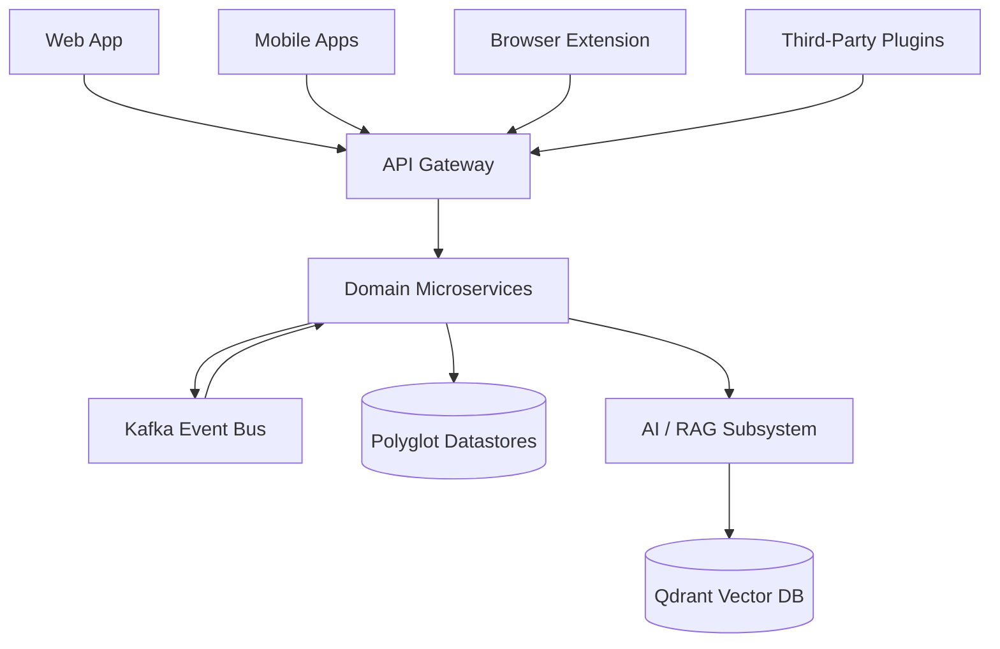
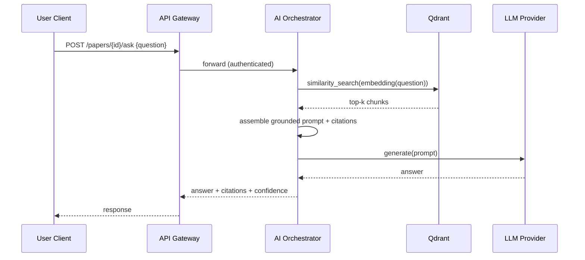
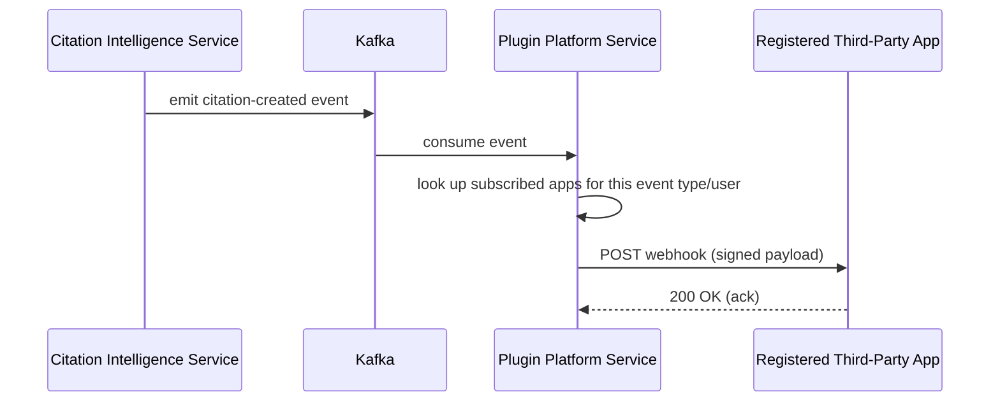
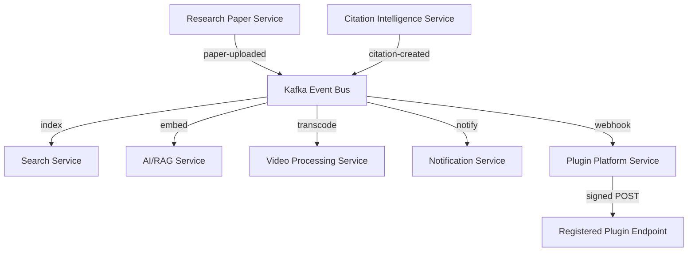
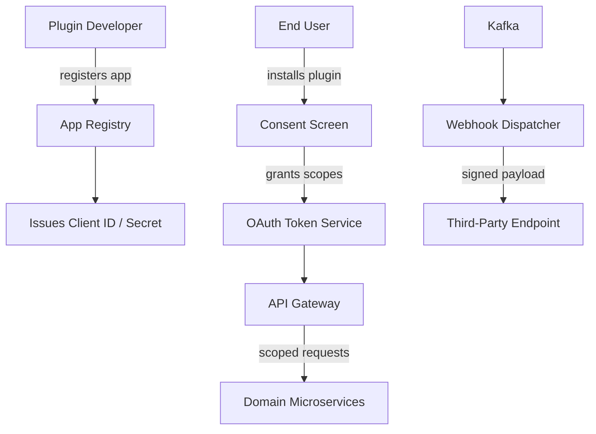
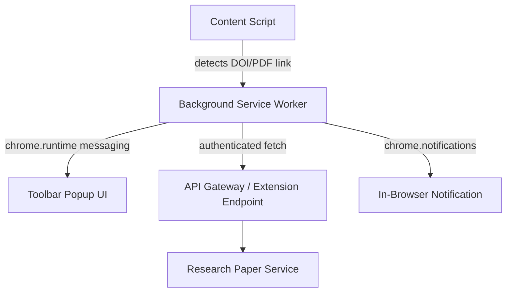
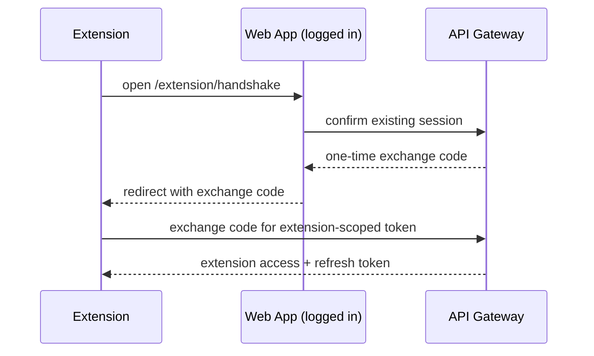
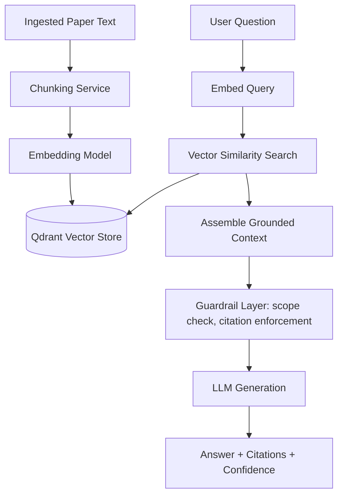
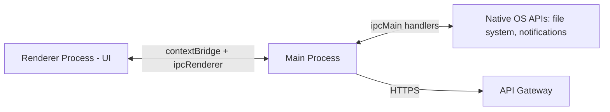

# ResearchReel
## Volume 2 — Software Architecture Document (SAD)

**Document Version:** 1.0
**Status:** Draft for Review
**Classification:** Internal / Confidential
**Related Documents:** Volume 1 (SRS), Volume 3 (Database & API), Volume 4 (Security & DevOps), Volume 5 (UI/UX & Wireframes)

---

## Table of Contents

1. [Introduction](#1-introduction)
2. [Architectural Goals & Constraints](#2-architectural-goals--constraints)
3. [High-Level Architecture](#3-high-level-architecture)
4. [Low-Level Architecture](#4-low-level-architecture)
5. [Microservices](#5-microservices)
6. [Event-Driven Architecture](#6-event-driven-architecture)
7. [Plugin Architecture](#7-plugin-architecture)
8. [Browser Integration](#8-browser-integration)
9. [AI Architecture](#9-ai-architecture)
10. [Inter-Process Communication (IPC)](#10-inter-process-communication-ipc)
11. [Backend](#11-backend)
12. [Cross-Cutting Concerns](#12-cross-cutting-concerns)
13. [Architecture Decision Records (ADR Log)](#13-architecture-decision-records-adr-log)
14. [Appendices](#14-appendices)

---

## 1. Introduction

### 1.1 Purpose

This document specifies how ResearchReel's functional and non-functional requirements (Volume 1) are realized in software. It covers system topology, service boundaries, the event backbone, the plugin and browser-extension surfaces, the AI/RAG subsystem, inter-process communication patterns, and backend implementation conventions. Database schema and API contracts are detailed in Volume 3; security controls in Volume 4; screen-level design in Volume 5.

### 1.2 Audience

Backend, frontend, mobile, and platform engineers; technical leads conducting design review; security and SRE teams; new engineers onboarding onto the codebase.

### 1.3 Relationship to Volume 1

Every architectural decision in this document traces back to one or more functional or non-functional requirements from Volume 1. Where a component exists specifically to satisfy a requirement, the requirement ID is cited inline (e.g., *satisfies FR-AI-002*).

---

## 2. Architectural Goals & Constraints

### 2.1 Goals

| ID | Goal | Driving Requirement(s) |
|---|---|---|
| AG-1 | Independent deployability of every service | NFR-MAINT-001 |
| AG-2 | Horizontal scalability to 1M+ users / 100K concurrent | NFR-SCALE-001, NFR-SCALE-002 |
| AG-3 | Sub-100ms p95 latency on feed and search | NFR-PERF-001, NFR-PERF-002 |
| AG-4 | Extensibility via browser extension and plugin SDK without destabilizing the core platform | FR-EXT-*, FR-PLUG-* |
| AG-5 | Forward compatibility with a future native desktop client (informs the IPC design now, even though desktop is out of scope this release) | Vol. 1 §5.2 |
| AG-6 | Clear separation between trusted first-party surfaces and untrusted third-party plugin code | FR-PLUG-006 |

### 2.2 Constraints

- All services must run as containers orchestrated by Kubernetes (AWS EKS).
- The AI/RAG subsystem must support swapping the underlying LLM provider without a client-facing contract change (vendor-lock mitigation).
- The browser extension must operate within Manifest V3 constraints (no persistent background pages; service-worker lifecycle).
- The plugin platform must never grant a third-party plugin direct datastore access — all access is API-mediated.

### 2.3 Architectural Style

ResearchReel uses a **decoupled, event-driven microservices architecture** with:
- **Synchronous** request/response (REST + internal gRPC) for user-facing, latency-sensitive operations.
- **Asynchronous** event-driven communication (Kafka) for cross-service side effects (indexing, notifications, embeddings).
- A **plugin/extension boundary** layered on top of the same public-facing API Gateway used by first-party clients, so third-party access never bypasses the platform's policy and rate-limit enforcement.

---

## 3. High-Level Architecture

### 3.1 System Context



### 3.2 Logical Infrastructure Topology

```text
               Clients (Web / Mobile / Extension / Plugins)
                              │
                        API Gateway (AuthN, rate limit, routing)
                              │
        ┌─────────────────────┼──────────────────────┐
        │                     │                       │
  Domain Services       Event Bus (Kafka)       AI/RAG Subsystem
        │                     │                       │
  Polyglot Datastores   Async Consumers          Qdrant Vector DB
```

### 3.3 Enterprise Service Topology

This release extends the prior architecture baseline with two new edge surfaces — the **Browser Extension Gateway** and the **Plugin Gateway** — both of which terminate at the same API Gateway as first-party clients, ensuring a single point of authentication, rate-limiting, and auditing.

```text
                                 INTERNET
                                     |
                               Cloudflare CDN
                                     |
                               Load Balancer
                                     |
                              Nginx API Gateway  ──── Plugin Gateway (scoped OAuth)
                                     |             ──── Extension Endpoint (SSO)
      ---------------------------------------------------------------------------------
      |           |            |            |            |            |               |
    Auth        User        Research      Reel         Video          AI            Citation
   Service     Service      Paper Svc    Service     Processing     Service       Intelligence
      |           |            |            |            |            |               |
   PostgreSQL  PostgreSQL   PostgreSQL   PostgreSQL    FFmpeg       Qdrant          Neo4j
    + Redis                  + S3         + S3        GPU Workers  Vector DB       Graph DB
      |           |            |            |            |            |               |
      ---------------------------------------------------------------------------------
                                     |
                               Event Bus (Kafka)
                                     |
      ---------------------------------------------------------------------------------
      |           |            |            |            |            |               |
   Recommend.   Search      Workspace      Chat       Social    Notification     Leaderboard
    Service    Service       Service      Service      Graph       Service         Service
      |           |            |            |            |            |               |
   Redis +    Elasticsearch  MongoDB      MongoDB      Neo4j       Redis +         Redis +
   Cassandra                                          Graph DB     Nodemailer      PostgreSQL
      |           |            |            |            |            |               |
      ---------------------------------------------------------------------------------
                                     |
                     Analytics Service        Plugin Platform Service        Admin/Moderation Service
                                     |                    |                            |
                            Kafka + ClickHouse      PostgreSQL + Redis            PostgreSQL
```

### 3.4 New Components Introduced in This Volume

| Component | Purpose | Satisfies |
|---|---|---|
| Plugin Platform Service | App registration, OAuth scoping, webhook dispatch, marketplace listing | FR-PLUG-001–010 |
| Extension Sync Endpoint | Lightweight SSO/session bridge for the browser extension | FR-EXT-003 |
| AI Orchestrator | Coordinates embedding, retrieval, prompt assembly, and LLM invocation as a distinct internal layer within the AI/RAG Service | FR-AI-001–012 |

---

## 4. Low-Level Architecture

### 4.1 Component View — Paper Ingestion → Reel Publication

```mermaid
flowchart LR
    Upload[Upload Controller] --> Validate[Validation & Virus/Hash Scan]
    Validate --> MetaExtract[Metadata Extraction]
    MetaExtract --> Persist[Persist to paper_db + S3]
    Persist --> Emit[Emit paper-uploaded event]
    Emit --> AIQueue[AI Ingestion Worker]
    Emit --> VidQueue[Reel Generation Worker]
    AIQueue --> Embed[Chunk + Embed → Qdrant]
    VidQueue --> Script[Script Generation]
    Script --> TTS[Text-to-Speech / Visual Assembly]
    TTS --> Transcode[FFmpeg Transcode]
    Transcode --> Caption[Caption Generation]
    Caption --> Ready[Mark Reel Ready]
    Ready --> Notify[Notify Author for Review]
```



### 4.2 Component View — AI Chat Request



### 4.3 Component View — Plugin Webhook Dispatch



### 4.4 Data Flow Boundaries

- **Trust boundary 1:** Public internet ↔ API Gateway. All inbound traffic is authenticated/authorized here regardless of client type (web, mobile, extension, plugin).
- **Trust boundary 2:** First-party services ↔ Plugin Platform Service. Plugins never call domain services directly; all access is mediated and scoped.
- **Trust boundary 3:** AI Orchestrator ↔ external LLM provider. Only de-identified, paper-scoped context crosses this boundary — no account credentials or unrelated user data.

---

## 5. Microservices

The platform comprises 18 domain/edge services. Each entry below extends the Volume 1 functional scope with its architectural responsibilities, primary datastore, and scaling profile.

| Service | Responsibility | Datastore | Scaling Profile |
|---|---|---|---|
| Auth Service | Identity, credentials, sessions, RBAC | PostgreSQL + Redis | Stateless; HPA 2–8 |
| User Profile Service | Profile, credentials, affiliations | PostgreSQL | Stateless; HPA 2–8 |
| Research Paper Service | Upload, DOI linking, metadata, versions | PostgreSQL + S3 | Stateless; HPA 2–8 |
| Reel Service | Reel metadata, likes/comments, view stats | PostgreSQL + S3/CDN | Stateless; HPA 2–10 |
| Video Processing Service | Transcoding, captioning, thumbnailing | FFmpeg GPU workers | Burst-aware HPA 2–12 |
| AI/RAG Service | Embedding, retrieval, generation, summarization | Qdrant | Burst-aware HPA 2–8 |
| Citation Intelligence Service | Citation graph, stance classification | Neo4j | Stateless; HPA 2–6 |
| Recommendation Service | Feed ranking, sponsored insertion | Redis + Cassandra | Stateless; HPA 2–8 |
| Search Service | Keyword + semantic search | Elasticsearch | Stateless; HPA 2–8 |
| Workspace Service | Collaborative docs, annotations, boards | MongoDB | Stateless; HPA 2–8 |
| Chat Service | 1:1/group messaging, presence | MongoDB + Redis | Stateless; HPA 2–8 |
| Social Graph Service | Follows, mentorship, institution links | Neo4j | Stateless; HPA 2–6 |
| Notification Service | Push/email/SMS dispatch | Redis + BullMQ | Stateless; HPA 2–6 |
| Leaderboard Service | Trending computation, rankings | Redis Sorted Sets | Stateless; HPA 2–6 |
| Analytics Service | Event ingestion, dashboards | ClickHouse | Stateless; HPA 2–6 |
| **Plugin Platform Service** *(new)* | App registry, OAuth scoping, webhook dispatch, marketplace | PostgreSQL + Redis | Stateless; HPA 2–6 |
| **Admin/Moderation Service** *(new)* | Moderation queue, audit log, appeals, feature flags | PostgreSQL | Stateless; HPA 2–4 |
| API Gateway | Routing, AuthN, rate limiting, CORS, request shaping for web/mobile/extension/plugin traffic | Redis (rate limits) | Stateless; HPA 2–10 |

### 5.1 Service Interaction Principles

- A service **never** queries another service's private database directly; all cross-service reads go through the owning service's API or a published event.
- Services that need eventual-consistency views of another domain (e.g., Search needing paper metadata) subscribe to that domain's events rather than polling.
- Each service owns its schema migrations independently; no shared migration tooling across service boundaries.

---

## 6. Event-Driven Architecture

### 6.1 Why Event-Driven

Several user-visible features (search indexing, embedding generation, notifications, leaderboard updates, citation alerts, plugin webhooks) are **reactions** to a small set of core domain events, not synchronous steps in the request that creates them. Decoupling these via Kafka satisfies AG-1 (independent deployability) and keeps the synchronous request path (e.g., paper upload) fast.

### 6.2 Core Event Catalog

| Event | Producer | Consumers | Purpose |
|---|---|---|---|
| `user-registered` | Auth Service | User Profile, Notification, Analytics | Initialize profile, send welcome email |
| `paper-uploaded` | Research Paper Service | AI/RAG, Search, Video Processing, Notification, Analytics | Trigger embedding, indexing, reel generation |
| `paper-revised` | Research Paper Service | AI/RAG, Search | Re-embed and re-index a new version |
| `reel-published` | Reel Service | Search, Recommendation, Notification, Analytics | Make reel discoverable and notify followers |
| `citation-created` | Citation Intelligence Service | Notification, Plugin Platform, Analytics | Notify cited author, dispatch webhooks |
| `follow-created` | Social Graph Service | Notification, Recommendation, Analytics | Notify followed user, adjust ranking signals |
| `moderation-action-taken` | Admin/Moderation Service | Notification, Analytics, Audit Log | Notify affected user, record audit trail |
| `plugin-installed` / `plugin-revoked` | Plugin Platform Service | Analytics, Audit Log | Track third-party access lifecycle |

### 6.3 Event Schema Convention

All events are versioned JSON (Avro schema registry planned for Volume 3 follow-up) with a common envelope:

```json
{
  "event_id": "uuid",
  "event_type": "paper-uploaded",
  "event_version": 1,
  "occurred_at": "ISO-8601 timestamp",
  "producer": "research-paper-service",
  "payload": { "...event-specific fields..." }
}
```

### 6.4 Delivery Guarantees

- **At-least-once** delivery is assumed; all consumers must be idempotent (deduplicate on `event_id`).
- Partition keys are chosen per-topic to preserve ordering where it matters (e.g., `paper_id` for paper-lifecycle events) while allowing parallelism across unrelated entities.
- Dead-letter topics capture events that fail consumer processing after retry exhaustion, surfaced on Grafana dashboards (Volume 4 §Monitoring).



---

## 7. Plugin Architecture

*Satisfies FR-PLUG-001–010.*

### 7.1 Design Principles

1. **No direct datastore access.** Plugins interact exclusively through the same versioned public API used internally, mediated by the Plugin Platform Service.
2. **Explicit, auditable consent.** Every scope a plugin requests is presented to the user in plain language before access is granted (FR-PLUG-004).
3. **Revocability.** Access tokens are revocable in real time; revocation immediately invalidates cached tokens at the Gateway.
4. **Sandboxed UI.** Any in-app plugin UI surface renders inside a sandboxed `<iframe>` with a locked-down `Content-Security-Policy` and communicates with the host page only via `postMessage` with a strict message schema (FR-PLUG-006).

### 7.2 Component Diagram



### 7.3 Scope Model

| Scope | Grants Access To |
|---|---|
| `read:profile` | Basic profile fields |
| `read:papers` | Paper metadata and full-text (where license permits) |
| `read:citations` | Citation graph for the user's own papers |
| `read:social` | Follower/following lists |
| `webhook:citations` | Subscribe to citation-created events for the user's papers |

### 7.4 Marketplace Review Pipeline

```text
Submission → Automated security scan (static analysis, scope-justification check)
           → Manual policy review
           → Sandboxed functional test pass
           → Approval → Listed in Marketplace
```

Rejected submissions receive a structured reason code and may be resubmitted after remediation (FR-PLUG-010).

### 7.5 Rate Limiting & Abuse Controls

Each registered application receives an independent rate-limit bucket (Redis-backed token bucket) separate from end-user rate limits, preventing one misbehaving plugin from degrading the platform for first-party clients (FR-PLUG-007).

---

## 8. Browser Integration

*Satisfies FR-EXT-001–010.*

### 8.1 Extension Architecture (Manifest V3)



- **Content Script:** Injected on publisher pages; scans the DOM for DOI patterns and direct PDF links. Read-only — never modifies the host page beyond rendering the "Capture" affordance.
- **Background Service Worker:** Manifest V3 event-driven worker (no persistent background page). Holds no long-lived in-memory session state; reads the session token from secure extension storage on each invocation.
- **Toolbar Popup:** Lightweight UI for capture confirmation, AI-chat quick-query (FR-EXT-009), and per-domain capture toggles (FR-EXT-010).

### 8.2 Authentication (SSO Bridge)

The extension never independently manages credentials. On install/first use, it opens a short-lived web view to the platform's `/extension/handshake` endpoint, which — if the user already has a valid web session — issues a scoped, extension-specific refresh token via a one-time exchange code. This satisfies FR-EXT-003 without ever exposing the user's primary session cookie to extension storage.



### 8.3 Paywall & Access-Control Respect

Per FR-EXT-006, the content script's detection logic only ever reads DOM metadata already rendered to the visible page in the user's authenticated publisher session — it issues no requests on the user's behalf to retrieve restricted content, and never injects code to bypass paywalls or DRM. If a PDF is not reachable by the extension, the user is prompted to enter a DOI manually.

### 8.4 Browser Support

Initial release targets Chrome and Firefox (FR-EXT-007) using the WebExtensions API for maximum shared code between the two; an Edge build is a packaging fast-follow given Edge's Chromium compatibility.

---

## 9. AI Architecture

*Satisfies FR-AI-001–012, FR-PAPER-010, FR-CITE-002.*

### 9.1 Subsystem Overview



### 9.2 Ingestion Pipeline

1. **Text extraction** from the source PDF (layout-aware extraction to preserve section boundaries).
2. **Chunking** using a recursive, section-aware splitter (target ~400–600 tokens per chunk with overlap) so retrieved chunks remain coherent and individually citable.
3. **Embedding** via a configurable embedding model behind an internal interface (`EmbeddingProvider`), allowing model swaps without touching calling code (per constraint in §2.2).
4. **Storage** of vectors plus chunk metadata (page/section reference, paper ID, chunk index) in Qdrant, partitioned by collection-per-shard for horizontal scaling.

### 9.3 Retrieval-Augmented Generation Flow

1. Incoming question is embedded using the same model family as ingestion.
2. Top-k (default k=6) chunks are retrieved by cosine similarity, scoped strictly to the paper(s) in context (never cross-paper unless the user explicitly invokes multi-paper comparison, FR-AI-010).
3. A **guardrail layer** checks retrieval confidence; if the top result falls below a similarity threshold, the system returns an explicit "out of scope for this paper" response rather than allowing the LLM to hallucinate an answer (FR-AI-004).
4. A grounded prompt is assembled embedding the retrieved chunks, an instruction to cite section references, and the conversation history (bounded to the last N turns, FR-AI-005).
5. The LLM generates an answer; the orchestrator post-processes the response to validate that every factual claim maps to a cited chunk before returning it to the client.

### 9.4 Summarization

Two summary tiers are generated at ingestion time and cached (not regenerated per-request) to control cost (FR-AI-006):
- **Abstract-level summary** — close to the source abstract's register, for researchers.
- **ELI5-level summary** — plain-language, for students and cross-disciplinary readers.

### 9.5 Provider Abstraction & Cost Controls

The AI Orchestrator sits behind a provider-agnostic interface for both embeddings and generation, so the underlying model vendor can change without breaking the public contract (constraint §2.2). Per-user rate limiting (FR-AI-008) and response caching for repeated questions on the same paper reduce inference cost at scale.

### 9.6 Feedback Loop

User-flagged inaccurate answers (FR-AI-009) are written to a review queue, sampled by the AI team to identify systematic retrieval or grounding failures, and inform chunking/embedding tuning over time.

---

## 10. Inter-Process Communication (IPC)

### 10.1 Scope of This Section

ResearchReel's *current* release is browser/mobile-only — there is no native desktop process today. This section specifies the IPC architecture for two things that do exist now, and establishes the pattern intended for the *future* native desktop client (Vol. 1 §5.2) so that the team designs the messaging layer consistently rather than retrofitting it later.

### 10.2 Browser Extension Internal IPC

Within the extension, three contexts run as effectively separate processes and must communicate via message-passing rather than shared memory:

| From | To | Channel | Payload |
|---|---|---|---|
| Content Script | Background Service Worker | `chrome.runtime.sendMessage` | Detected DOI/PDF candidate |
| Background Service Worker | Toolbar Popup | `chrome.runtime.onMessage` / port connection | Capture status, auth state |
| Background Service Worker | Web Page (via content script relay) | `window.postMessage` (origin-checked) | Reel-ready notification trigger |

All messages carry a `type` discriminator and are validated against a fixed schema before being acted on; unrecognized message types are dropped and logged.

### 10.3 Internal Service-to-Service "IPC" (gRPC)

For latency-sensitive internal calls between microservices (as distinct from the public REST surface exposed at the Gateway), ResearchReel uses gRPC over the cluster-internal network. This is conceptually inter-process communication between independently deployed containers and is governed by the same idempotency and timeout conventions as external calls (Volume 3 §API Specifications covers contract detail).

### 10.4 Forward-Compatible Design for a Future Desktop Client

When a native desktop client is built, it will follow an Electron-style main-process/renderer-process split:



- **Renderer process** has no direct Node.js/OS access; it communicates exclusively through a `contextBridge`-exposed, narrowly-typed API.
- **Main process** owns all OS-level capability (file system access for local PDF drag-and-drop, native notifications) and proxies network calls to the same API Gateway used by web/mobile/extension clients — preserving AG-4 (single point of policy enforcement) even for a future native surface.
- This pattern is documented now so that the eventual desktop build reuses the extension's message-schema conventions (§10.2) rather than inventing a third, incompatible IPC style.

---

## 11. Backend

### 11.1 Technology Stack

| Layer | Technology | Rationale |
|---|---|---|
| API Gateway & most domain services | Node.js (TypeScript) + Express | Fast I/O for request-routing workloads; team familiarity; consistent with existing SAD baseline |
| Video Processing workers | Python + FFmpeg bindings | Mature media-processing ecosystem |
| AI/RAG Orchestrator | Python (FastAPI) | Native fit with ML/embedding tooling |
| Citation Intelligence / Social Graph | Node.js (TypeScript) + Neo4j driver | Graph-query ergonomics, shared language with rest of platform |
| Plugin Platform Service | Node.js (TypeScript) | Shares OAuth/middleware libraries with Auth Service |

### 11.2 Repository Strategy

A **monorepo** houses all first-party services, the web frontend, and the browser extension, with shared internal packages (`@researchreel/auth-middleware`, `@researchreel/event-schemas`, `@researchreel/api-client`) to avoid duplicated contract logic across services and the extension. Each service retains an independent build/deploy pipeline (AG-1) despite the shared repository.

### 11.3 API Design Conventions

- Public REST endpoints follow resource-oriented naming (`/papers/{id}`, `/papers/{id}/ask`) and are versioned via the `Accept` header (`Accept: application/vnd.researchreel.v1+json`).
- Internal service-to-service calls use gRPC with protobuf-defined contracts stored in a shared schema package.
- All mutating endpoints are idempotent where the client can supply an `Idempotency-Key` header, particularly important for plugin-initiated requests that may be retried.

### 11.4 Coding Standards & Quality Gates

- Linting (ESLint/Prettier for TS, Black/Ruff for Python) enforced in CI prior to merge.
- ≥70% automated test coverage on core services (NFR-MAINT-002), enforced as a CI gate.
- Every service exposes `/health/live` and `/health/ready` endpoints per the standard contract (Volume 4 §Monitoring).

### 11.5 Configuration Management

Configuration is layered: defaults in-repo → environment-specific overrides via Kubernetes ConfigMaps → secrets via Kubernetes Secrets (never co-located with non-secret config), consistent with the existing deployment baseline.

---

## 12. Cross-Cutting Concerns

### 12.1 Error Handling

All services return a consistent error envelope:

```json
{
  "error": {
    "code": "RESOURCE_NOT_FOUND",
    "message": "Human-readable message",
    "request_id": "uuid"
  }
}
```

### 12.2 Observability

Structured JSON logs, Prometheus metrics, and a shared `request_id` propagated via header across service boundaries (and into Kafka event envelopes) enable end-to-end tracing of a single user action across the asynchronous pipeline. Full detail in Volume 4.

### 12.3 Caching Strategy (Architectural View)

Redis is used for three distinct caching purposes that must not share key namespaces: (1) rate-limit counters, (2) session/token caches, (3) computed feed/leaderboard caches. Volume 3 details TTLs and invalidation rules per key family.

### 12.4 Feature Flagging

Feature flags (FR-ADMIN-005) are evaluated at the API Gateway and within service middleware via a shared flag-evaluation library, allowing cohort-based rollout of architecturally risky changes (e.g., a new AI provider) without a full deployment.

---

## 13. Architecture Decision Records (ADR Log)

| ADR | Decision | Status |
|---|---|---|
| ADR-001 | Adopt event-driven architecture (Kafka) for cross-service side effects rather than synchronous fan-out calls | Accepted |
| ADR-002 | Plugins access the platform exclusively via the public API Gateway; no direct datastore grants | Accepted |
| ADR-003 | Browser extension uses a one-time exchange-code handshake rather than sharing the primary session cookie | Accepted |
| ADR-004 | AI provider access is abstracted behind an internal interface to avoid vendor lock-in | Accepted |
| ADR-005 | Desktop IPC pattern (Electron main/renderer split) is documented now, ahead of implementation, to keep extension and future desktop messaging conventions consistent | Accepted |
| ADR-006 | Monorepo for first-party code, independent deploy pipelines per service | Accepted |

---

## 14. Appendices

### 14.1 Diagram Index

| Diagram | Section |
|---|---|
| System Context | 3.1 |
| Enterprise Service Topology | 3.3 |
| Paper Ingestion Component Flow | 4.1 |
| AI Chat Sequence | 4.2 |
| Plugin Webhook Sequence | 4.3 |
| Event Bus Flow | 6.4 |
| Plugin Architecture Component Diagram | 7.2 |
| Extension SSO Handshake Sequence | 8.2 |
| AI Subsystem Overview | 9.1 |
| Future Desktop IPC Pattern | 10.4 |

### 14.2 Open Issues Carried from Volume 1

- OI-01 (citation stance classification accuracy) directly affects §9 guardrail thresholds and remains unresolved pending benchmarking.
- OI-03 (fair-use boundaries for full-text display) affects how much source text the AI Orchestrator may surface verbatim in citations (§9.3, step 5) and requires legal sign-off before launch.

---

*End of Volume 2. Proceed to Volume 3 — Database & API for schema-level and contract-level detail underpinning the services described here.*
