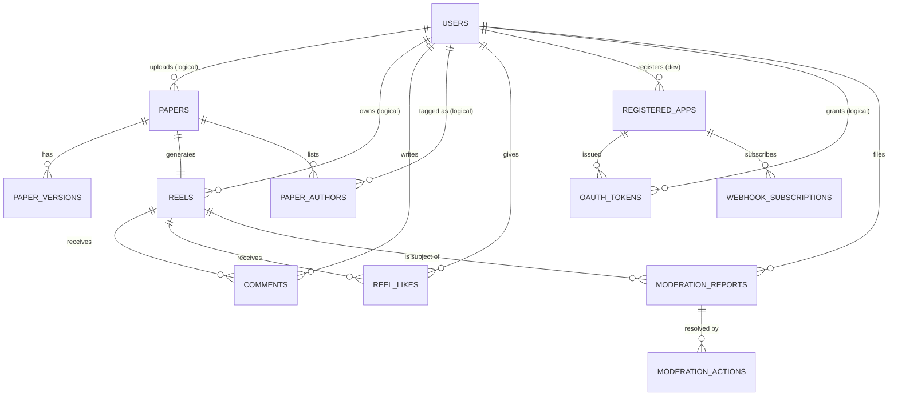
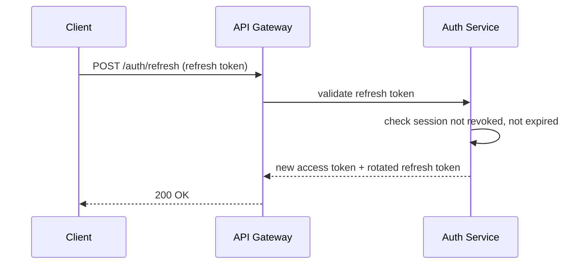
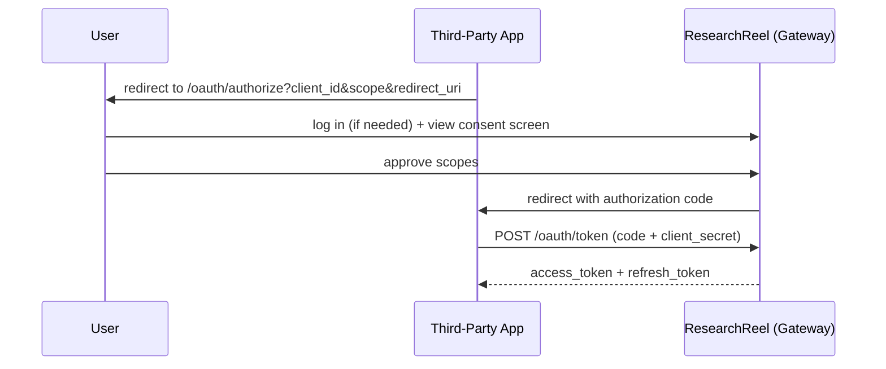

# ResearchReel
## Volume 3 — Database & API Specification

**Document Version:** 1.0
**Status:** Draft for Review
**Classification:** Internal / Confidential
**Related Documents:** Volume 1 (SRS), Volume 2 (Software Architecture), Volume 4 (Security & DevOps), Volume 5 (UI/UX & Wireframes)

---

## Table of Contents

1. [Introduction](#1-introduction)
2. [Data Architecture Overview](#2-data-architecture-overview)
3. [ER Diagram](#3-er-diagram)
4. [Database Schema](#4-database-schema)
5. [Table Definitions](#5-table-definitions)
6. [Relationships](#6-relationships)
7. [Non-Relational Data Models](#7-non-relational-data-models)
8. [API Specifications](#8-api-specifications)
9. [Authentication](#9-authentication)
10. [Caching](#10-caching)
11. [Appendices](#11-appendices)

---

## 1. Introduction

### 1.1 Purpose

This document specifies the persistent data model and the API contracts that expose it, for every datastore introduced in Volume 2's service topology. It is the authoritative reference for schema migrations, query design, and client/plugin integration.

### 1.2 Scope

Covers: relational schemas (PostgreSQL) for Auth, Profile, Paper, Reel, Plugin Platform, and Admin/Moderation services; document schemas (MongoDB) for Workspace and Chat; graph schemas (Neo4j) for Citation Intelligence and Social Graph; search index mapping (Elasticsearch); vector collection schema (Qdrant); wide-column schema (Cassandra) for Recommendation clickstreams; analytical schema (ClickHouse); and the Redis key-space conventions used for caching, sessions, and rate limiting across all services. It also specifies the public REST API surface, authentication mechanics, and caching rules.

### 1.3 Conventions

- All primary keys are UUIDv4 unless otherwise noted.
- All timestamps are stored in UTC, ISO-8601 format.
- Table/column names use `snake_case`; API fields use `camelCase` in JSON payloads.
- Every table includes `created_at` and `updated_at` audit columns unless explicitly noted as immutable-only (`created_at` alone).

---

## 2. Data Architecture Overview

ResearchReel uses **polyglot persistence**: each microservice owns exactly one primary datastore, and no service is permitted to query another service's datastore directly (Volume 2 §5.1). Cross-service relationships are therefore maintained as **logical references** (a stored UUID with no enforced foreign key across the service boundary) rather than database-level foreign keys, and are kept consistent via the event bus (Volume 2 §6).

| Datastore | Owning Service(s) | Data Shape |
|---|---|---|
| PostgreSQL | Auth, User Profile, Research Paper, Reel, Plugin Platform, Admin/Moderation, Leaderboard (snapshot tables) | Relational |
| MongoDB | Workspace, Chat | Document |
| Neo4j | Citation Intelligence, Social Graph | Graph |
| Elasticsearch | Search | Inverted index |
| Qdrant | AI/RAG | Vector |
| Cassandra | Recommendation | Wide-column / time-series |
| ClickHouse | Analytics | Columnar OLAP |
| Redis | Gateway, Auth (sessions), Leaderboard, Notification (queues), all services (caching) | Key-value / sorted sets |

---

## 3. ER Diagram

### 3.1 Core Relational Entities (Cross-Service Logical Model)

The diagram below spans multiple service-owned PostgreSQL databases. Dashed-style relationships in the legend below the diagram denote **logical references** (UUID only, no DB-level FK) across a service boundary; solid relationships are enforced FKs within the same database.



### 3.2 Notes on Cross-Database References

- `PAPERS.uploaded_by` stores a `users.id` value with no enforced FK (Paper Service does not share a database with Auth/Profile Service). Referential integrity is maintained by validating the user ID against the Auth Service at write time and reconciled asynchronously via the `user-registered`/account-deletion event stream.
- Account deletion (FR-PROF-008) triggers a `user-deleted` event; consuming services anonymize or cascade-delete their logical references per the data-retention policy (Volume 4).

---

## 4. Database Schema

### 4.1 `auth_db` (PostgreSQL — Auth Service)

| Table | Purpose |
|---|---|
| `users` | Core identity record, credentials hash, role |
| `sessions` | Active refresh-token sessions per device |
| `mfa_devices` | TOTP device registrations |
| `login_attempts` | Rolling log for lockout/anomaly detection |
| `password_resets` | Time-limited reset tokens |

### 4.2 `user_profile_db` (PostgreSQL — User Profile Service)

| Table | Purpose |
|---|---|
| `profiles` | Display name, bio, interests, visibility setting |
| `academic_credentials` | Degrees, institution, advisor |
| `orcid_links` | Verified ORCID iD associations |

### 4.3 `paper_db` (PostgreSQL — Research Paper Service)

| Table | Purpose |
|---|---|
| `papers` | Canonical paper record and metadata |
| `paper_versions` | Versioned revisions of a paper |
| `paper_authors` | Co-author tagging with confirmation status |
| `paper_licenses` | License type per paper |

### 4.4 `reel_db` (PostgreSQL — Reel Service)

| Table | Purpose |
|---|---|
| `reels` | Reel record, status, duration, S3/CDN refs |
| `reel_stats` | View count, watch-through rate, avg. duration |
| `comments` | Threaded comments on a reel |
| `reel_likes` | Like records (user × reel) |
| `moderation_reports` | User-filed reports against content |

### 4.5 `plugin_platform_db` (PostgreSQL — Plugin Platform Service)

| Table | Purpose |
|---|---|
| `registered_apps` | Third-party application registry |
| `oauth_tokens` | Issued scoped access/refresh tokens |
| `app_scopes` | Scopes requested/granted per app |
| `webhook_subscriptions` | Event-type subscriptions per app |
| `marketplace_listings` | Review status and listing metadata |

### 4.6 `admin_db` (PostgreSQL — Admin/Moderation Service)

| Table | Purpose |
|---|---|
| `moderation_actions` | Action log (remove, warn, suspend) |
| `audit_log` | Full administrative audit trail |
| `appeals` | User-filed appeals of moderation decisions |
| `feature_flags` | Flag definitions and cohort targeting rules |

---

## 5. Table Definitions

### 5.1 `users` (auth_db)

| Column | Type | Constraints |
|---|---|---|
| `id` | UUID | PK |
| `email` | VARCHAR(255) | UNIQUE, NOT NULL |
| `password_hash` | VARCHAR(255) | NOT NULL (Argon2id) |
| `role` | ENUM | `student`, `researcher`, `faculty`, `institution_admin`, `platform_admin`, `moderator` |
| `email_verified` | BOOLEAN | DEFAULT false |
| `mfa_enabled` | BOOLEAN | DEFAULT false |
| `account_status` | ENUM | `active`, `locked`, `deactivated`, `deleted` |
| `created_at` | TIMESTAMPTZ | NOT NULL |
| `updated_at` | TIMESTAMPTZ | NOT NULL |

### 5.2 `sessions` (auth_db)

| Column | Type | Constraints |
|---|---|---|
| `id` | UUID | PK |
| `user_id` | UUID | FK → `users.id` |
| `refresh_token_hash` | VARCHAR(255) | NOT NULL, UNIQUE |
| `device_label` | VARCHAR(255) | nullable |
| `issued_at` | TIMESTAMPTZ | NOT NULL |
| `expires_at` | TIMESTAMPTZ | NOT NULL |
| `revoked_at` | TIMESTAMPTZ | nullable |

### 5.3 `papers` (paper_db)

| Column | Type | Constraints |
|---|---|---|
| `id` | UUID | PK |
| `doi` | VARCHAR(255) | UNIQUE, nullable |
| `title` | TEXT | NOT NULL |
| `abstract` | TEXT | nullable |
| `uploaded_by` | UUID | logical ref → `users.id` (Auth Service) |
| `pdf_s3_key` | VARCHAR(512) | NOT NULL |
| `license_type` | VARCHAR(64) | NOT NULL |
| `status` | ENUM | `processing`, `published`, `takedown_requested`, `removed` |
| `current_version_id` | UUID | FK → `paper_versions.id` |
| `created_at` | TIMESTAMPTZ | NOT NULL |
| `updated_at` | TIMESTAMPTZ | NOT NULL |

### 5.4 `paper_versions` (paper_db)

| Column | Type | Constraints |
|---|---|---|
| `id` | UUID | PK |
| `paper_id` | UUID | FK → `papers.id` |
| `version_number` | INTEGER | NOT NULL |
| `pdf_s3_key` | VARCHAR(512) | NOT NULL |
| `created_at` | TIMESTAMPTZ | NOT NULL |

### 5.5 `paper_authors` (paper_db)

| Column | Type | Constraints |
|---|---|---|
| `id` | UUID | PK |
| `paper_id` | UUID | FK → `papers.id` |
| `user_id` | UUID | logical ref → `users.id`, nullable (unregistered co-author) |
| `display_name` | VARCHAR(255) | NOT NULL |
| `confirmation_status` | ENUM | `pending`, `confirmed`, `declined` |

### 5.6 `reels` (reel_db)

| Column | Type | Constraints |
|---|---|---|
| `id` | UUID | PK |
| `paper_id` | UUID | logical ref → `papers.id` (Paper Service) |
| `owner_id` | UUID | logical ref → `users.id` |
| `status` | ENUM | `pending_review`, `published`, `removed` |
| `duration_seconds` | SMALLINT | CHECK (30–90) |
| `hls_manifest_url` | VARCHAR(512) | NOT NULL |
| `caption_vtt_url` | VARCHAR(512) | NOT NULL |
| `thumbnail_url` | VARCHAR(512) | NOT NULL |
| `created_at` | TIMESTAMPTZ | NOT NULL |
| `updated_at` | TIMESTAMPTZ | NOT NULL |

### 5.7 `reel_stats` (reel_db)

| Column | Type | Constraints |
|---|---|---|
| `reel_id` | UUID | PK, FK → `reels.id` |
| `view_count` | BIGINT | DEFAULT 0 |
| `avg_watch_seconds` | NUMERIC(6,2) | DEFAULT 0 |
| `completion_rate` | NUMERIC(5,4) | DEFAULT 0 |
| `like_count` | BIGINT | DEFAULT 0 |
| `comment_count` | BIGINT | DEFAULT 0 |

### 5.8 `registered_apps` (plugin_platform_db)

| Column | Type | Constraints |
|---|---|---|
| `id` | UUID | PK |
| `developer_user_id` | UUID | logical ref → `users.id` |
| `name` | VARCHAR(255) | NOT NULL |
| `client_id` | VARCHAR(64) | UNIQUE, NOT NULL |
| `client_secret_hash` | VARCHAR(255) | NOT NULL |
| `redirect_uris` | TEXT[] | NOT NULL |
| `review_status` | ENUM | `draft`, `in_review`, `approved`, `rejected` |
| `created_at` | TIMESTAMPTZ | NOT NULL |

### 5.9 `oauth_tokens` (plugin_platform_db)

| Column | Type | Constraints |
|---|---|---|
| `id` | UUID | PK |
| `app_id` | UUID | FK → `registered_apps.id` |
| `user_id` | UUID | logical ref → `users.id` |
| `scopes` | TEXT[] | NOT NULL |
| `access_token_hash` | VARCHAR(255) | NOT NULL |
| `refresh_token_hash` | VARCHAR(255) | nullable |
| `issued_at` | TIMESTAMPTZ | NOT NULL |
| `expires_at` | TIMESTAMPTZ | NOT NULL |
| `revoked_at` | TIMESTAMPTZ | nullable |

### 5.10 `moderation_actions` (admin_db)

| Column | Type | Constraints |
|---|---|---|
| `id` | UUID | PK |
| `report_id` | UUID | logical ref → `moderation_reports.id` (Reel Service) |
| `moderator_id` | UUID | logical ref → `users.id` |
| `action_type` | ENUM | `dismiss`, `remove_content`, `warn`, `suspend` |
| `reason` | TEXT | NOT NULL |
| `created_at` | TIMESTAMPTZ | NOT NULL |

---

## 6. Relationships

### 6.1 Within-Service (Enforced FK) Relationships

| Parent | Child | Cardinality | On Delete |
|---|---|---|---|
| `papers` | `paper_versions` | 1:N | CASCADE |
| `papers` | `paper_authors` | 1:N | CASCADE |
| `reels` | `reel_stats` | 1:1 | CASCADE |
| `reels` | `comments` | 1:N | CASCADE |
| `registered_apps` | `oauth_tokens` | 1:N | CASCADE on app deletion |
| `registered_apps` | `webhook_subscriptions` | 1:N | CASCADE |

### 6.2 Cross-Service (Logical) Relationships

| Source Table.Column | Logical Target | Consistency Mechanism |
|---|---|---|
| `papers.uploaded_by` | `auth_db.users.id` | Validated at write time; reconciled via `user-deleted` event |
| `reels.paper_id` | `paper_db.papers.id` | Validated at reel-creation time via Paper Service API call |
| `oauth_tokens.user_id` | `auth_db.users.id` | Revoked via `user-deleted` event consumer in Plugin Platform Service |
| Neo4j `(:User)` nodes | `auth_db.users.id` (as node property `userId`) | Synced via `user-registered` / `user-deleted` events |
| Elasticsearch `papers_index._id` | `paper_db.papers.id` | Synced via `paper-uploaded` / `paper-revised` events |
| Qdrant point `payload.paper_id` | `paper_db.papers.id` | Synced via `paper-uploaded` event consumed by AI/RAG Service |

### 6.3 Cascade & Deletion Policy

Because referential integrity cannot be enforced by the database across service boundaries, **cascade behavior on account/paper deletion is implemented as an event-driven saga**: the originating service emits a deletion event; each downstream service consumes it and independently deletes, anonymizes, or tombstones its own logical references within its documented SLA (see Volume 4 data-retention policy for per-service SLAs).

---

## 7. Non-Relational Data Models

### 7.1 Neo4j — Citation Intelligence

```text
(:Paper {id, title, publishedAt})
(:Paper)-[:CITES {stance: "supporting"|"contradicting"|"neutral"}]->(:Paper)
(:Author {userId})-[:AUTHORED]->(:Paper)
```

Indexes: `Paper.id` (unique constraint), `Author.userId` (unique constraint).

### 7.2 Neo4j — Social Graph

```text
(:User {userId})-[:FOLLOWS]->(:User)
(:User)-[:MENTORS]->(:User)
(:User)-[:AFFILIATED_WITH]->(:Institution {id, name})
(:User)-[:CO_AUTHORED_WITH]->(:User)
```

### 7.3 MongoDB — Workspace Service

```json
// workspaces collection
{
  "_id": "uuid",
  "name": "string",
  "ownerId": "uuid",
  "members": [{ "userId": "uuid", "role": "owner|editor|viewer" }],
  "linkedPaperIds": ["uuid"],
  "createdAt": "ISODate",
  "updatedAt": "ISODate"
}

// workspace_documents collection
{
  "_id": "uuid",
  "workspaceId": "uuid",
  "title": "string",
  "contentLatex": "string",
  "version": 3,
  "history": [{ "version": 2, "snapshotS3Key": "string", "savedAt": "ISODate" }],
  "updatedAt": "ISODate"
}
```

### 7.4 MongoDB — Chat Service

```json
// conversations collection
{
  "_id": "uuid",
  "type": "direct|group",
  "participantIds": ["uuid"],
  "createdAt": "ISODate"
}

// messages collection
{
  "_id": "uuid",
  "conversationId": "uuid",
  "senderId": "uuid",
  "body": "string",
  "attachedReelId": "uuid|null",
  "sentAt": "ISODate"
}
```

Indexes: `messages.conversationId + sentAt` (compound, for scrollback pagination).

### 7.5 Elasticsearch — `papers_index`

| Field | Type | Notes |
|---|---|---|
| `title` | `text` (with `.keyword` sub-field) | Boosted in relevance scoring |
| `abstract` | `text` | |
| `authors` | `text` (with `.keyword` sub-field) | Supports disambiguated exact-match filtering |
| `field` | `keyword` | Facetable |
| `publishedAt` | `date` | Range filter |
| `citationCount` | `integer` | Sort/filter |
| `institutionIds` | `keyword[]` | Facetable |

### 7.6 Qdrant — `paper_chunks` Collection

| Field | Type | Notes |
|---|---|---|
| Vector | `float[]` (dimension per embedding model) | Cosine distance |
| `payload.paper_id` | string (UUID) | Scoping filter for retrieval |
| `payload.chunk_index` | integer | Ordering |
| `payload.section` | string | Citation reference (e.g., "Methodology") |
| `payload.page` | integer | Citation reference |

### 7.7 Cassandra — Recommendation Clickstream

```text
TABLE feed_events (
  user_id UUID,
  event_time TIMESTAMP,
  reel_id UUID,
  event_type TEXT,  -- 'impression' | 'click' | 'like' | 'skip'
  PRIMARY KEY ((user_id), event_time)
) WITH CLUSTERING ORDER BY (event_time DESC);
```

Partitioned by `user_id` for efficient "recent activity for this user" reads feeding the ranking model.

### 7.8 ClickHouse — Analytics

```text
TABLE events (
  event_id UUID,
  event_type LowCardinality(String),
  user_id_hash String,   -- pseudonymized per NFR-ANLY-004
  surface LowCardinality(String),
  occurred_at DateTime,
  properties String      -- JSON blob
) ENGINE = MergeTree()
ORDER BY (occurred_at, event_type);
```

Daily rollups are materialized into a separate `daily_aggregates` table to support long-range dashboards without scanning raw event volume (FR-ANLY-008).

---

## 8. API Specifications

### 8.1 Conventions

- Base path: `https://api.researchreel.app/v1`
- All responses are JSON; errors follow the envelope defined in Volume 2 §12.1.
- List endpoints support cursor-based pagination (`?cursor=...&limit=...`), not offset-based, to remain stable under concurrent writes.
- Mutating requests from plugins must include an `Idempotency-Key` header (Volume 2 §11.3).

### 8.2 Endpoint Catalog (Representative)

| Method | Path | Purpose | Auth Required |
|---|---|---|---|
| POST | `/auth/register` | Create account | No |
| POST | `/auth/login` | Authenticate, issue tokens | No |
| POST | `/auth/refresh` | Exchange refresh token for new access token | Refresh token |
| POST | `/auth/logout` | Revoke current session | Yes |
| GET | `/users/{id}` | Fetch public profile | Optional |
| PATCH | `/users/{id}` | Update own profile | Yes (self) |
| POST | `/users/{id}/follow` | Follow a user | Yes |
| POST | `/papers` | Upload/link a paper | Yes |
| GET | `/papers/{id}` | Fetch paper detail + metadata | Optional |
| POST | `/papers/{id}/ask` | AI chat question against a paper | Yes |
| GET | `/papers/{id}/citations` | Citation graph for a paper | Optional |
| GET | `/reels/{id}` | Fetch reel detail | Optional |
| POST | `/reels/{id}/comments` | Add a comment | Yes |
| POST | `/reels/{id}/like` | Like a reel | Yes |
| GET | `/search` | Keyword/semantic search | Optional |
| GET | `/feed` | Personalized home feed | Yes |
| POST | `/workspaces` | Create a workspace | Yes |
| POST | `/workspaces/{id}/members` | Invite a collaborator | Yes (owner/editor) |
| GET | `/notifications` | Notification center feed | Yes |
| POST | `/plugins/register` | Register a developer application | Yes (developer) |
| GET | `/plugins/marketplace` | Browse approved plugins | Optional |
| POST | `/oauth/authorize` | Plugin consent screen handoff | Yes |
| POST | `/oauth/token` | Exchange auth code for scoped token | App credentials |

### 8.3 Example — `POST /papers/{id}/ask`

**Request:**
```json
{
  "question": "What method did the authors use for evaluation?",
  "sessionId": "uuid-or-null"
}
```

**Response (200):**
```json
{
  "answer": "The authors evaluated their model using a held-out test set with five-fold cross-validation...",
  "citations": [
    { "section": "Methodology", "page": 4 }
  ],
  "confidence": "high",
  "sessionId": "uuid"
}
```

**Response (422 — out of scope):**
```json
{
  "error": {
    "code": "QUESTION_OUT_OF_SCOPE",
    "message": "This question doesn't appear to relate to the content of this paper.",
    "request_id": "uuid"
  }
}
```

### 8.4 Example — `GET /feed`

**Query Parameters:** `cursor`, `limit` (default 20, max 50)

**Response (200):**
```json
{
  "items": [
    {
      "reelId": "uuid",
      "title": "string",
      "thumbnailUrl": "string",
      "durationSeconds": 47,
      "sponsored": false,
      "author": { "userId": "uuid", "displayName": "string" }
    }
  ],
  "nextCursor": "opaque-string-or-null"
}
```

### 8.5 Webhook Payload — `citation-created` (Plugin-Facing)

```json
{
  "eventType": "citation-created",
  "occurredAt": "ISO-8601",
  "data": {
    "citedPaperId": "uuid",
    "citingPaperId": "uuid",
    "stance": "supporting"
  },
  "signature": "hmac-sha256(...)"
}
```

Plugins must verify the `signature` header against their registered webhook secret before trusting the payload.

---

## 9. Authentication

### 9.1 Token Model

| Token | Lifetime | Storage (Client) | Purpose |
|---|---|---|---|
| Access Token (JWT) | 15 minutes | Memory only | Authorizes API requests |
| Refresh Token | 30 days (web/mobile), 7 days (extension) | HttpOnly secure cookie (web) / secure keystore (mobile) / extension storage (extension) | Issues new access tokens |
| Plugin Access Token | 1 hour | Held server-side by the third-party app | Scoped API access |
| Plugin Refresh Token | 90 days, revocable | Held server-side by the third-party app | Re-issues plugin access tokens |

### 9.2 JWT Claims (Access Token)

```json
{
  "sub": "user-uuid",
  "role": "researcher",
  "scope": "self",
  "iat": 1719400000,
  "exp": 1719400900,
  "jti": "token-uuid"
}
```

### 9.3 Refresh Flow



Refresh tokens are **rotated on every use** (single-use); reuse of a superseded refresh token immediately revokes the entire session chain as a replay-attack defense.

### 9.4 Plugin OAuth2 Flow (Authorization Code)



This mirrors RFC 6749 §4.1 with ResearchReel-specific scopes (Volume 2 §7.3).

### 9.5 Extension Token Issuance

The extension does not use the standard OAuth2 authorization-code flow; it uses the exchange-code handshake described in Volume 2 §8.2, producing an extension-scoped refresh token with a shorter (7-day) lifetime than web/mobile, reflecting its higher exposure surface (a user's machine/browser profile).

### 9.6 Authorization Model

Role-based access control (RBAC) gates administrative and moderation endpoints; resource-level checks (e.g., "is this user the workspace owner") are evaluated per-request within the owning service, not centrally in the Gateway, since only the owning service has the authoritative resource-ownership data.

---

## 10. Caching

### 10.1 Redis Key Namespace Convention

`{service}:{entity}:{id}[:{sub-entity}]`

Examples: `auth:session:{userId}`, `feed:ranked:{userId}`, `leaderboard:trending:papers:{window}`, `ratelimit:gw:{clientIp}`.

### 10.2 Cache Categories & TTLs

| Category | Key Pattern | TTL | Invalidation Trigger |
|---|---|---|---|
| Session/token cache | `auth:session:{userId}` | Matches refresh-token lifetime | Explicit on logout/revocation |
| Rate-limit counters | `ratelimit:gw:{clientIp}` / `ratelimit:app:{appId}` | 15-minute sliding window | Natural expiry |
| Feed cache | `feed:ranked:{userId}` | 5 minutes | New `reel-published` event for a followed entity invalidates early |
| Search autocomplete cache | `search:autocomplete:{prefix}` | 10 minutes | Natural expiry; acceptable staleness |
| Leaderboard snapshot | `leaderboard:{type}:{window}` | 60 seconds | Recomputed on schedule (FR-LEAD-006) |
| AI answer cache | `ai:answer:{paperId}:{questionHash}` | 24 hours | Invalidated on `paper-revised` event |
| Plugin token introspection cache | `plugin:token:{tokenHash}` | 60 seconds | Invalidated immediately on revocation (explicit delete, not just TTL expiry) |

### 10.3 Cache-Aside Pattern

All read-heavy endpoints (feed, search, paper detail) follow cache-aside: check Redis → on miss, query the owning datastore → populate cache → return. Write paths never write directly to cache; they invalidate the relevant key(s) and let the next read repopulate it, avoiding cache/datastore divergence under concurrent writes.

### 10.4 Plugin Token Revocation — Special Case

Because plugin access must be revocable "at any time" (FR-PLUG-005) and the Gateway introspects tokens from a short-TTL cache for performance, revocation is implemented as an **explicit cache delete** at the moment of revocation (not a wait-for-TTL-expiry approach), ensuring the FR-PLUG-005 "real time" requirement is actually met rather than bounded only by the 60-second TTL.

---

## 11. Appendices

### 11.1 Data Retention Cross-Reference

Detailed per-table retention periods and the account/paper deletion saga's per-service SLAs are specified in Volume 4 (Security & DevOps) to keep retention policy alongside the broader compliance and security controls it supports.

### 11.2 Schema Evolution Policy

- PostgreSQL migrations are additive-first (new nullable columns before backfill, then constraint tightening in a follow-up release) to support zero-downtime deploys.
- Elasticsearch index changes use the alias + reindex pattern (write to a new index version, backfill, swap the alias) rather than in-place mapping changes.
- Qdrant collection schema changes (e.g., embedding dimension change on model swap) are versioned as a new collection (`paper_chunks_v2`) with a dual-write/backfill cutover, per the provider-abstraction principle in Volume 2 §9.5.

### 11.3 Open Issues Carried Forward

- A formal Avro/Protobuf schema registry for Kafka events (flagged in Volume 2 §6.3) is not yet implemented; current JSON-envelope events lack compile-time contract enforcement between producer and consumer.
- Cross-service referential consistency (§6.3) relies on saga-style eventual consistency; no distributed-transaction mechanism is in place if an event is dropped after producer commit but before consumer processing — dead-letter monitoring (Volume 2 §6.4) is the primary mitigation pending a more formal reconciliation job.

---

*End of Volume 3. Proceed to Volume 4 — Security & DevOps for the controls that protect this data model and the pipelines that deploy the services built on it.*
