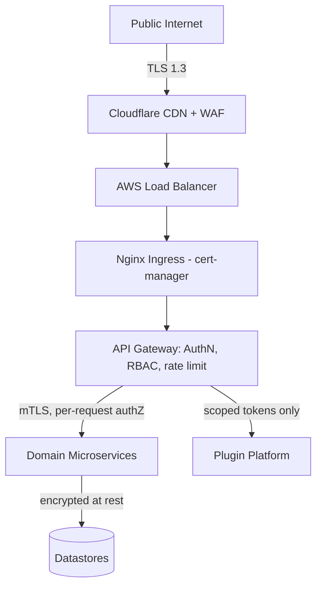

# ResearchReel
## Volume 4 — Security & DevOps

**Document Version:** 1.0
**Status:** Draft for Review
**Classification:** Internal / Confidential
**Related Documents:** Volume 1 (SRS), Volume 2 (Software Architecture), Volume 3 (Database & API), Volume 5 (UI/UX & Wireframes)

---

## Table of Contents

1. [Introduction](#1-introduction)
2. [Security Architecture Overview](#2-security-architecture-overview)
3. [Zero Trust Architecture](#3-zero-trust-architecture)
4. [Threat Modeling](#4-threat-modeling)
5. [Encryption](#5-encryption)
6. [Role-Based Access Control (RBAC)](#6-role-based-access-control-rbac)
7. [DevOps & CI/CD](#7-devops--cicd)
8. [Containerization (Docker)](#8-containerization-docker)
9. [Kubernetes & Orchestration](#9-kubernetes--orchestration)
10. [Monitoring & Observability](#10-monitoring--observability)
11. [Incident Response & Data Retention](#11-incident-response--data-retention)
12. [Appendices](#12-appendices)

---

## 1. Introduction

### 1.1 Purpose

This document specifies the security architecture and operational practices that protect ResearchReel's users, data, and infrastructure, and the DevOps pipeline that builds, tests, and deploys the services described in Volumes 2 and 3. It is the authoritative reference for security review, penetration-test scoping, and platform-engineering on-call practice.

### 1.2 Relationship to Prior Volumes

NFR-SEC-001–005 and NFR-COMP-001–004 (Volume 1) define the *requirements*; this document defines the *controls* that satisfy them. ADR-002 and ADR-003 (Volume 2) — plugin API-mediation and the extension SSO handshake — are treated here as security boundaries, not just architectural choices.

---

## 2. Security Architecture Overview

ResearchReel's security model rests on three pillars:

1. **Zero Trust** — no implicit trust based on network location; every request is authenticated and authorized regardless of origin (internal service, first-party client, browser extension, or third-party plugin).
2. **Defense in Depth** — overlapping controls at the network, application, and data layers so a single control failure does not constitute a full breach.
3. **Least Privilege** — every credential, service account, and plugin scope grants the minimum access necessary for its function, with explicit, auditable elevation when more is needed.



---

## 3. Zero Trust Architecture

### 3.1 Principles Applied

| Principle | Application in ResearchReel |
|---|---|
| Verify explicitly | Every request — internal service call, first-party client, extension, or plugin — carries a verifiable identity (JWT, mTLS client cert, or scoped OAuth token); none are trusted by network position alone. |
| Least-privilege access | RBAC scopes at the Gateway; plugin scopes at the Plugin Platform Service; resource-ownership checks at the owning service (Volume 3 §9.6). |
| Assume breach | Network segmentation (Kubernetes NetworkPolicies) limits lateral movement even if a single pod is compromised; secrets are short-lived and rotated. |
| Micro-segmentation | Each microservice's pods accept traffic only from the specific namespaces/services that legitimately call them, enforced via NetworkPolicy, not just logical API design. |

### 3.2 Service-to-Service Trust

Internal gRPC calls (Volume 2 §10.3) are authenticated via mutual TLS issued by an internal certificate authority, rotated automatically on a short interval. A service's identity (its mTLS certificate's SAN) is checked against an explicit allow-list at the receiving service before any request is processed — a compromised pod cannot silently call services outside its declared dependency graph.

### 3.3 Trust Boundaries (Recap and Hardening)

The three trust boundaries identified in Volume 2 §4.4 are hardened as follows:

| Boundary | Hardening Control |
|---|---|
| Internet ↔ API Gateway | WAF rules, TLS 1.3 termination, rate limiting, bot/abuse detection |
| First-party services ↔ Plugin Platform | No shared credentials; plugin requests carry only scoped OAuth tokens, never internal service-account credentials |
| AI Orchestrator ↔ external LLM provider | Outbound allow-list (egress NetworkPolicy); payloads scrubbed of account-identifying fields before leaving the cluster boundary |

### 3.4 Continuous Verification

Session and plugin tokens are short-lived (Volume 3 §9.1) specifically so that compromise of a single token has a bounded blast radius; there is no long-lived "trusted forever" credential anywhere in the system, including for internal service accounts.

---

## 4. Threat Modeling

Threats are modeled per the **STRIDE** framework (Spoofing, Tampering, Repudiation, Information Disclosure, Denial of Service, Elevation of Privilege) against the platform's highest-risk data flows.

### 4.1 Flow: Paper Upload & Ingestion (UC-01)

| STRIDE Category | Threat | Mitigation |
|---|---|---|
| Spoofing | Attacker uploads a paper while impersonating another author | JWT-bound `uploaded_by`; co-author tagging requires explicit confirmation (FR-PAPER-006) |
| Tampering | Malicious PDF crafted to exploit the extraction/transcoding pipeline | Sandboxed extraction workers; file-type validation beyond extension/MIME sniffing; resource-limited worker containers |
| Repudiation | Author disputes having uploaded a paper later flagged for takedown | Immutable upload audit log with IP, timestamp, and session ID (Volume 3 §5.10-adjacent audit table) |
| Information Disclosure | PDF metadata leaks unintended personal data (e.g., embedded reviewer comments) | Metadata extraction strips non-bibliographic embedded fields before indexing |
| Denial of Service | Mass upload of oversized/malformed files to exhaust transcoding workers | Per-account upload rate limiting; 100MB hard size cap (FR-PAPER-001); queue backpressure with HPA (Volume 2 §5) |
| Elevation of Privilege | Crafted metadata fields used to inject unintended roles/flags into downstream records | Strict schema validation on ingestion; no user-supplied field is ever interpolated into a privileged code path |

### 4.2 Flow: AI Chat / RAG (UC-02)

| STRIDE Category | Threat | Mitigation |
|---|---|---|
| Spoofing | N/A beyond standard session auth | Standard JWT validation |
| Tampering | Prompt injection via paper content or user input attempting to override system instructions | Guardrail layer enforces a fixed instruction hierarchy; user/paper content is never treated as an instruction channel (Volume 2 §9.3) |
| Repudiation | Dispute over what the AI "said" | Full conversation logs retained per data-retention policy (§11.2) |
| Information Disclosure | AI answer leaks content from a paper the requesting user shouldn't access (e.g., access-restricted/removed paper) | Retrieval scoping checks paper status/visibility before querying Qdrant, not only at the original chat-entry point |
| Denial of Service | Inference-cost exhaustion via high-volume questioning | Per-user rate limiting (FR-AI-008); cached answers for repeated questions (Volume 3 §10.2) |
| Elevation of Privilege | Crafted question attempting to extract system prompt or other users' data via the LLM | Guardrail layer scope-checks every retrieval to the requested paper only; system prompt is never echoed back regardless of phrasing |

### 4.3 Flow: Plugin OAuth & Webhook Delivery (UC-05)

| STRIDE Category | Threat | Mitigation |
|---|---|---|
| Spoofing | Malicious app impersonates a legitimate registered plugin | `client_id`/`client_secret` pair validated server-side; redirect URI allow-list enforced exactly (no wildcard matching) |
| Tampering | Webhook payload modified in transit | HMAC-SHA256 signature over the payload (Volume 3 §8.5); plugin verifies before trusting |
| Repudiation | Plugin developer denies having received/processed a webhook | Delivery attempts and response codes logged server-side for dispute resolution |
| Information Disclosure | Over-broad scope grant exposes more user data than the plugin needs | Granular scope model (Volume 2 §7.3); marketplace review checks scope justification (FR-PLUG-010) |
| Denial of Service | Compromised/abusive plugin floods the API | Per-app rate-limit bucket independent of end-user limits (FR-PLUG-007) |
| Elevation of Privilege | Plugin attempts to call an unscoped endpoint using a token issued for a narrower scope | Gateway-level scope enforcement rejects any request outside the token's granted scopes, regardless of the plugin's own client-side logic |

### 4.4 Flow: Browser Extension SSO Handshake (UC-04)

| STRIDE Category | Threat | Mitigation |
|---|---|---|
| Spoofing | Malicious page attempts to trigger the handshake on the user's behalf | Handshake endpoint only accepts requests from the extension's registered origin; one-time exchange codes are single-use and short-lived (≤60 seconds) |
| Tampering | Exchange code intercepted and replayed | Single-use enforcement invalidates the code immediately on first redemption |
| Information Disclosure | Primary session cookie exposed to extension storage | Architecturally prevented — the extension never receives the primary session cookie, only a derived extension-scoped token (Volume 2 §8.2, ADR-003) |
| Denial of Service | N/A (low-volume, user-initiated flow) | Standard Gateway rate limiting applies as a backstop |
| Elevation of Privilege | Extension token used to call scopes beyond what the extension needs | Extension-scoped tokens carry a fixed, narrower claim set than full web-session tokens |

### 4.5 Flow: Moderation Actions (UC-06)

| STRIDE Category | Threat | Mitigation |
|---|---|---|
| Spoofing | Non-moderator attempts to perform a moderation action | RBAC enforcement at both Gateway and Admin/Moderation Service (defense in depth) |
| Repudiation | Moderator denies having taken an action later disputed in an appeal | Immutable, append-only `audit_log` table (Volume 3 §4.6) with actor, timestamp, and reason |
| Elevation of Privilege | Moderator attempts an action beyond their granted authority (e.g., a regional moderator suspending a global admin) | Role-hierarchy checks prevent moderation actions against accounts of equal or higher privilege tier |

---

## 5. Encryption

### 5.1 In Transit

- All external traffic terminates TLS 1.3 at the CDN/load balancer (NFR-SEC-001); no plaintext HTTP path exists, including for internal health-check probes from outside the cluster.
- Internal service-to-service gRPC traffic uses mutual TLS (§3.2), not just transport encryption — both ends authenticate.
- WebSocket connections (Chat, Workspace) upgrade over an already-TLS-terminated connection; no separate unencrypted WS fallback is permitted.

### 5.2 At Rest

| Data Class | Encryption Approach |
|---|---|
| PostgreSQL databases | AES-256 encryption at the storage-volume level (AWS EBS/RDS encryption) |
| S3 objects (PDFs, video assets) | SSE-KMS with per-bucket customer-managed keys |
| MongoDB (Workspace, Chat) | Encrypted storage engine at rest |
| Qdrant vector store | Encrypted volume at rest; vectors are not independently human-readable but are still treated as derived sensitive data |
| Redis | Encrypted volume at rest; no persistent storage of raw access tokens (only hashes, per Volume 3 §5.9) |
| Backups/snapshots | Inherit the same encryption as their source datastore; no unencrypted backup export path exists |

### 5.3 Key Management

- All KMS keys are customer-managed (not AWS-managed defaults) to support key rotation policy and access auditing.
- Key rotation occurs on a scheduled interval; rotation does not require re-encrypting existing data immediately (envelope encryption allows old data to remain readable under the prior key version until naturally rewritten).
- Access to KMS decrypt operations is itself RBAC-gated and logged — a compromised application credential without the corresponding IAM grant cannot decrypt data it shouldn't.

### 5.4 Password & Secret Hashing

- User passwords: Argon2id (NFR-SEC-002), with per-user salts and a memory/time cost profile reviewed periodically against current hardware capability.
- OAuth client secrets and refresh tokens (Volume 3 §5.8–5.9): stored only as salted hashes; the plaintext secret is shown to the developer exactly once at registration time and is not retrievable thereafter.

### 5.5 Secrets Management

Per the existing baseline (no credentials in source control, ConfigMaps, or image layers), secrets are injected exclusively via Kubernetes Secrets with `secretKeyRef`. A future-tracked improvement (§12.3) is migration to a dedicated secrets manager (e.g., HashiCorp Vault or AWS Secrets Manager) for dynamic secret leasing, ahead of the desktop client's eventual native-credential needs (Volume 2 §10.4).

---

## 6. Role-Based Access Control (RBAC)

### 6.1 Roles (Recap from Volume 3 §5.1 `users.role`)

`student`, `researcher`, `faculty`, `institution_admin`, `platform_admin`, `moderator`. A separate, non-overlapping permission set applies to `registered_apps` (plugins), gated by OAuth scope rather than role.

### 6.2 Permission Matrix (Representative)

| Action | Student | Researcher | Faculty | Institution Admin | Moderator | Platform Admin |
|---|---|---|---|---|---|---|
| Upload a paper | ✗ | ✓ | ✓ | ✗ | ✗ | ✓ |
| Comment / like a reel | ✓ | ✓ | ✓ | ✓ | ✓ | ✓ |
| Create a workspace | ✓ | ✓ | ✓ | ✗ | ✗ | ✓ |
| Review/approve own reel | ✗ | ✓ | ✓ | ✗ | ✗ | ✓ |
| View moderation queue | ✗ | ✗ | ✗ | ✗ | ✓ | ✓ |
| Take moderation action | ✗ | ✗ | ✗ | ✗ | ✓ | ✓ |
| Manage institution roster | ✗ | ✗ | ✗ | ✓ | ✗ | ✓ |
| Toggle feature flags | ✗ | ✗ | ✗ | ✗ | ✗ | ✓ |
| Approve marketplace plugin listing | ✗ | ✗ | ✗ | ✗ | ✗ | ✓ |

### 6.3 Enforcement Points

RBAC is checked at **two layers** by design (defense in depth, §2):
1. **API Gateway** — coarse-grained: does this role even have access to this endpoint class (e.g., `/admin/*` requires `moderator` or `platform_admin`)?
2. **Owning service** — fine-grained, resource-specific: e.g., is this *specific* user the owner/editor of *this specific* workspace (Volume 3 §9.6)? The Gateway cannot make this check because it doesn't hold resource-ownership data.

### 6.4 Privilege Escalation Safeguards

- Role changes (e.g., promoting a user to `moderator`) require platform-admin action and are written to the immutable audit log.
- A user cannot grant themselves a higher role through any self-service profile-update path; the `role` column is not editable via the standard profile-update endpoint (Volume 3 §8.2 `PATCH /users/{id}`) under any circumstance.

---

## 7. DevOps & CI/CD

### 7.1 Environments

| Environment | Purpose | Data |
|---|---|---|
| `dev` | Active feature development, ephemeral per-branch namespaces | Synthetic/seeded data only |
| `staging` | Pre-production validation, mirrors prod topology at reduced scale | Anonymized snapshot of production data |
| `production` | Live user traffic | Real user data |

### 7.2 Branching & Release Strategy

- Trunk-based development with short-lived feature branches merged via pull request, gated by required CI checks and at least one peer review.
- `main` is always deployable; releases are tagged, not branched, to avoid long-lived divergence between release and main.

### 7.3 CI/CD Pipeline

Builds on the existing baseline pipeline (GitHub Actions, `.github/workflows/deploy.yml`), extended with security gates appropriate to this volume:

```text
Git Push (main)
      ↓
audit-and-test job
  ├── npm ci / pip install (backend + frontend + AI services)
  ├── npm audit / pip-audit --severity=high
  ├── SAST scan (static application security testing)
  ├── lint + unit tests (Jest / pytest)
  └── build (frontend, extension bundle)
      ↓
container-security job
  ├── Build images (api-gateway, video-worker, rag-service, plugin-platform, frontend, extension package)
  ├── Trivy image vulnerability scan (block on critical/high)
  └── Push scanned images → GHCR
      ↓
deploy-to-kubernetes job
  ├── kubectl apply -f k8s/ (all manifests, including new plugin-platform and admin-moderation deployments)
  ├── kubectl set image (rolling update with new SHA tag)
  └── Post-deploy /api/health verification gate
      ↓
rollback (automatic on health-gate failure)
  └── kubectl rollout undo
```

### 7.4 Deployment Strategy

- **Rolling updates** are the default for stateless services, governed by `maxUnavailable`/`maxSurge` settings tuned per service criticality.
- Database migrations run as a pre-deploy job, additive-first (Volume 3 §11.2), so the previous service version remains compatible with the new schema during the rollout window.
- A failed post-deploy health check triggers automatic rollback rather than paging first — minimizing time-to-mitigation for straightforward regressions.

### 7.5 Infrastructure as Code

Cluster and supporting cloud resources (EKS, RDS, S3 buckets, IAM roles, KMS keys) are provisioned via Terraform, version-controlled alongside application code, with `terraform plan` output required as part of pull-request review for any infrastructure change.

---

## 8. Containerization (Docker)

### 8.1 Multi-Stage Build Pattern (Baseline, Reaffirmed)

Every service follows the existing multi-stage pattern to minimize image size and attack surface:

```dockerfile
# Stage 1 — Install dependencies
FROM node:18-alpine AS deps
WORKDIR /app
COPY package*.json ./
RUN npm ci --only=production

# Stage 2 — Runtime image (no dev tools, no build cache)
FROM node:18-alpine AS runner
WORKDIR /app
RUN addgroup -S appgroup && adduser -S appuser -G appgroup
COPY --from=deps /app/node_modules ./node_modules
COPY src ./src
USER appuser
CMD ["node", "src/server.js"]
```

### 8.2 Hardening Additions for This Volume

- **Non-root execution** is mandatory for every container (added `USER appuser` directive above); no service runs as `root` inside its container, including the AI/RAG and Video Processing GPU workers.
- **Read-only root filesystem** is enabled by default at the Kubernetes pod-spec level (§9.3), with explicit, narrowly-scoped writable volume mounts only where a service genuinely needs local scratch space (e.g., transcoding temp files).
- **Image provenance**: base images are pinned by digest (not just tag) in production manifests to prevent silent upstream base-image drift; Trivy scanning (§7.3) blocks any image with a critical/high CVE without an approved waiver.
- **No secrets baked into images** — reaffirms the existing baseline; this is enforced both by code review and by a CI step that scans built images for accidentally embedded credentials before push.

### 8.3 Plugin/Extension Build Artifacts

The browser extension is packaged as a separate, signed build artifact (not a server-side container) but follows the same CI security gates — dependency audit, SAST, and a manifest-permission review step confirming the extension requests no broader `permissions`/`host_permissions` than its declared functionality requires (Volume 2 §8.1).

---

## 9. Kubernetes & Orchestration

### 9.1 Namespace Layout (Extended)

| Namespace | Purpose |
|---|---|
| `researchreel` | Core domain microservices (as per existing baseline) |
| `researchreel-plugin` | Plugin Platform Service, isolated for tighter NetworkPolicy control given its third-party-facing role |
| `researchreel-admin` | Admin/Moderation Service, isolated given its elevated-privilege operations |
| `researchreel-ai` | AI/RAG Service and GPU-backed workers, isolated for resource-quota and node-pool targeting (GPU nodes) |

### 9.2 Network Policies (Zero Trust Enforcement)

Default-deny ingress is applied cluster-wide; each service's NetworkPolicy explicitly allow-lists only the namespaces/services that legitimately call it. For example, the Plugin Platform Service accepts ingress only from the API Gateway namespace — no domain microservice is permitted to initiate a connection to it, since plugin-platform traffic only ever flows Gateway → Plugin Platform → (webhook egress).

```yaml
# Illustrative excerpt — full manifests live in k8s/network-policies.yml
apiVersion: networking.k8s.io/v1
kind: NetworkPolicy
metadata:
  name: plugin-platform-ingress
  namespace: researchreel-plugin
spec:
  podSelector:
    matchLabels: { app: plugin-platform-service }
  policyTypes: [Ingress]
  ingress:
    - from:
        - namespaceSelector:
            matchLabels: { name: researchreel-gateway }
```

### 9.3 Pod Security Standards

- All namespaces enforce the Kubernetes **"restricted"** Pod Security Standard: no privileged containers, no host-network/host-PID access, mandatory non-root, read-only root filesystem by default (§8.2).
- Resource `requests`/`limits` are mandatory on every container spec to prevent noisy-neighbor resource exhaustion across services sharing a node.

### 9.4 Horizontal Pod Autoscaling (Reaffirmed + Extended)

The existing HPA table (CPU/memory-triggered scaling, 65–80% thresholds) is extended to cover the two new services:

| Service | Min Replicas | Max Replicas | CPU Trigger | Memory Trigger |
|---|---|---|---|---|
| Plugin Platform Service | 2 | 6 | 70% | 80% |
| Admin/Moderation Service | 2 | 4 | 70% | 80% |

### 9.5 Secrets at the Orchestration Layer

Kubernetes Secrets remain the injection mechanism (per existing baseline), scoped per-namespace so that, e.g., the `researchreel-plugin` namespace cannot read secrets belonging to `researchreel-admin` even if a pod were compromised — namespace-scoped RBAC on Secret access is enforced, not just convention.

---

## 10. Monitoring & Observability

### 10.1 Logging (Reaffirmed Baseline)

Winston (structured JSON) for application logs, Morgan for HTTP access logs, Fluentbit forwarding container logs to the centralized ELK/CloudWatch stack, with error tracking via Sentry/CloudWatch alarms. This volume adds:

- **Security-relevant log category**: authentication failures, RBAC denials, plugin-scope violations, and moderation actions are tagged with a `security_event: true` field and routed to a dedicated, longer-retention log index for audit purposes, distinct from general application-debug logs.

### 10.2 Metrics & Dashboards (Reaffirmed + Extended)

Prometheus/Grafana/Node Exporter/Kube-State-Metrics remain the baseline. New dashboards introduced for this volume's scope:

- **Plugin Platform health**: per-app request volume, error rate, and rate-limit rejection rate (helps distinguish a misbehaving plugin from a platform issue).
- **AI Orchestrator cost/latency**: token usage, cache-hit rate (Volume 3 §10.2 AI answer cache), and first-token latency, since this subsystem has both a latency SLA (NFR-PERF-005) and a direct cost-sensitivity not shared by other services.
- **Kafka consumer lag by topic**: critical for the event-driven saga pattern (Volume 3 §6.3) — sustained lag on a deletion-related topic is a compliance risk (delayed data erasure), not just a performance concern, and is alerted accordingly.

### 10.3 Service Level Objectives (SLOs)

| SLO | Target | Source Requirement |
|---|---|---|
| Core read-path availability | 99.9% monthly | NFR-AVAIL-001 |
| Feed/search p95 latency | < 100ms | NFR-PERF-001/002 |
| AI chat first-token p95 latency | < 2s | NFR-PERF-005 |
| Plugin token revocation propagation | < 5s (cache-delete based, Volume 3 §10.4) | FR-PLUG-005 |
| Moderation queue SLA (high-severity report reviewed) | < 4 hours | Internal operational target |

### 10.4 Alerting & On-Call

Alerts are tiered: **page** (SLO-breaching, customer-facing), **ticket** (degraded but not breaching), and **dashboard-only** (informational). Security-relevant alerts (repeated auth failures from a single source, anomalous plugin scope-violation rate, sustained dead-letter growth on a deletion topic) page the on-call engineer regardless of customer-facing impact, since these are leading indicators of either an attack or a compliance gap.

### 10.5 Health Endpoints (Reaffirmed)

The `/api/health` contract (liveness/readiness, dependency checks for PostgreSQL/Redis/Elasticsearch/RAG Service) remains as specified in the existing baseline and is also the post-deploy gate referenced in §7.4.

---

## 11. Incident Response & Data Retention

### 11.1 Incident Response Process

1. **Detect** — alert fires (§10.4) or report received (security disclosure, user report).
2. **Triage** — on-call assesses severity and scope within a defined response-time target per severity tier.
3. **Contain** — revoke affected credentials/tokens, isolate affected pods/namespaces via NetworkPolicy if needed.
4. **Eradicate & Recover** — patch root cause, redeploy, restore from backup if data integrity is in question.
5. **Post-incident review** — blameless write-up with timeline and follow-up action items, tracked to closure.

### 11.2 Data Retention Policy (Per-Service SLA)

This fulfills the cross-reference deferred from Volume 3 §11.1.

| Data Class | Retention | Deletion SLA on Account Deletion Event |
|---|---|---|
| Account credentials & profile | Until deletion requested | 30 days (allows for accidental-deletion recovery window) |
| Uploaded papers (author-initiated deletion) | Until takedown approved | 7 days from approval |
| Reels & engagement stats | Tied to parent paper/reel lifecycle | Cascades with parent deletion |
| Chat messages | 3 years rolling, or until a participant requests deletion | 30 days |
| Raw analytics events | 13 months, then rolled into anonymized aggregates (FR-ANLY-008) | N/A (already pseudonymized, Volume 3 §7.8) |
| Moderation audit log | 7 years (compliance/audit requirement) | Not deleted on account deletion — retained for legal/audit purposes with the actor pseudonymized after account deletion |
| Plugin OAuth tokens | Until revoked or expired | Immediate (cache-delete, Volume 3 §10.4) |

### 11.3 GDPR/CCPA Operational Mapping

| Requirement (Volume 1) | Operational Mechanism |
|---|---|
| NFR-COMP-001 (GDPR export/delete) | `GET /users/{id}/export` triggers a data-aggregation job across all owning services; deletion triggers the event-driven saga (Volume 3 §6.3) |
| NFR-COMP-002 (CCPA opt-out) | A `do_not_sell` flag on the profile suppresses the user's data from any advertising-data-sharing pipeline at the Analytics/Recommendation layer |
| NFR-COMP-003 (minor protections) | Age-gate at registration; accounts flagged 13–17 default to `profile_visibility: followers_only` and are excluded from ad-personalization data feeds |

---

## 12. Appendices

### 12.1 Security Control Cross-Reference

| Volume 1 Requirement | Volume 4 Control |
|---|---|
| NFR-SEC-001 (TLS 1.3) | §5.1 |
| NFR-SEC-002 (Argon2id) | §5.4 |
| NFR-SEC-003 (RBAC) | §6 |
| NFR-SEC-004 (pen testing) | §7.3 SAST gate + scheduled external pen test prior to major releases (process, not automated in pipeline) |
| NFR-SEC-005 (no plaintext secrets) | §5.5, §8.2 |
| FR-PLUG-006 (sandboxed plugin UI) | Volume 2 §7.1, reaffirmed as a security boundary in §4.3 of this volume |

### 12.2 Penetration Testing Scope (Recommended)

Prior to each major release: external network/API penetration test covering the public Gateway surface, the plugin OAuth flow (§4.3), and the browser-extension handshake (§4.4) specifically, given these are the platform's primary third-party-facing trust boundaries.

### 12.3 Tracked Future Improvements

- Migration from Kubernetes Secrets to a dedicated secrets manager with dynamic leasing (§5.5).
- Formal schema registry for Kafka events (carried forward from Volume 3 §11.3) — also a security-relevant gap, since a malformed/unvalidated event is itself a potential injection surface for downstream consumers.
- Automated reconciliation job for the deletion saga (Volume 3 §6.3), beyond dead-letter-queue monitoring, to provide a stronger compliance guarantee for GDPR Article 17 timelines.

---

*End of Volume 4. Proceed to Volume 5 — UI/UX & Wireframes for the screen-level experience built on top of the architecture, data model, and security controls specified in Volumes 2–4.*
